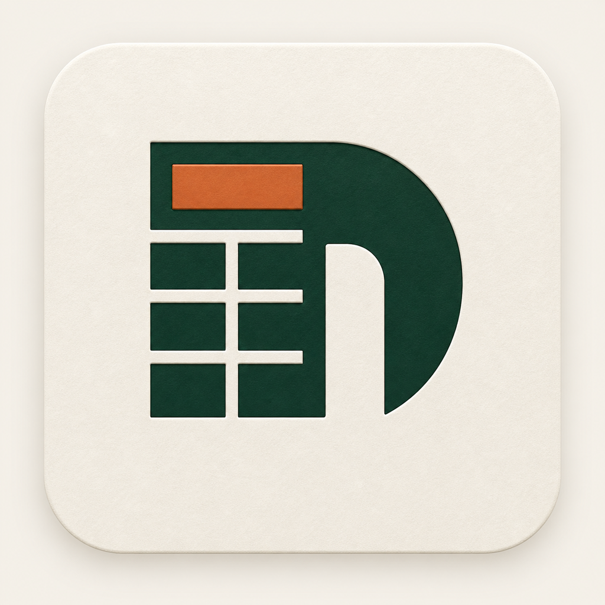
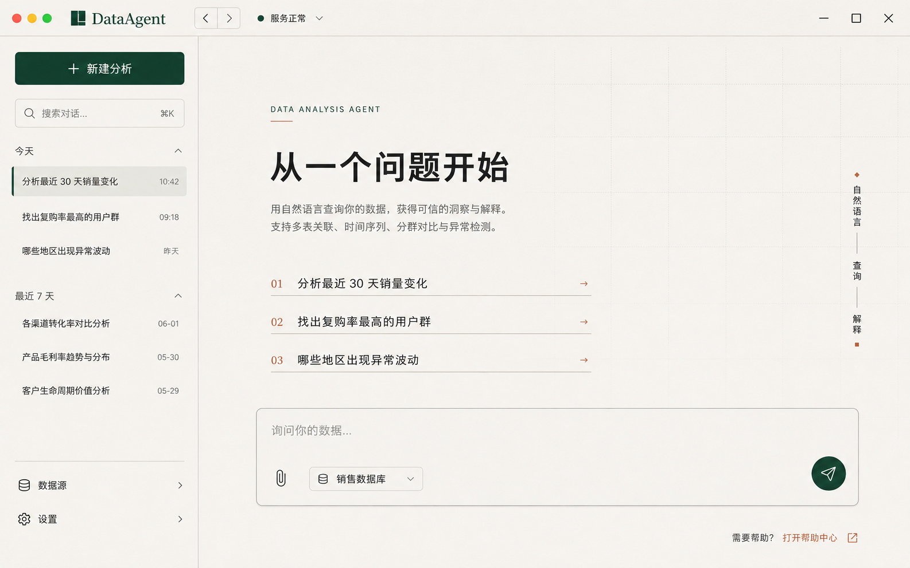
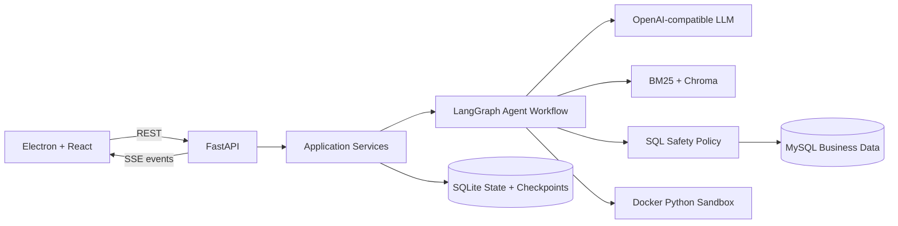

<div align="center">
  
  <h1>DataAgent</h1>
  <p>用于数据分析的桌面 AI Agent</p>
</div>

DataAgent 将自然语言问题转换为可审查、可执行的分析过程：检索相关表结构和业务知识，规划分析步骤，安全执行 SQL，并生成指标、图表与结论。前端通过 REST 获取持久化结果，通过 SSE 实时展示 Agent 的执行过程。

受到 SpringAI Alibaba 的启发，初期部分java实现大量参考了其 DataAgent 的设计。为了进一步学习，重新基于 python 完成了 ReAct 框架的 DataAgent。

目前只是一个类似于RAG助手的项目，后续打算基于此项目进一步去加入一些**评测**、**自验证**、**自迭代**等内容。

在“晚点”报道的一篇内容中看到：大厂某产品将自研Harness改成了ClaudeCode，效果就好了许多。所以我也简单做了一个基于 Claude Agent SDK 的版本，也感受到了 SDK 带来的一些限制，于是暂且搁置。

本项目更多是用于自己学习，所以有很多不足的地方。

**在自己上手之后，才能够真正地体会到其他前沿Harness设计的精妙。**

## 前端预览

前端结合 一些 taste skill，生图设计logo、设计界面，并由 codex 编码实现。





## 项目来源与代码归属

本项目 fork 自 [spring-ai-alibaba/DataAgent](https://github.com/spring-ai-alibaba/DataAgent)，并在其基础上发展出多套实现方案，主要用于自己学习。

| 实现 | 目录/分支 | 代码归属 |
| --- | --- | --- |
| python 实现，更多会关注这里的代码完善（FastAPI + LangGraph + Electron/React） | `data-agent-python-backend`、`data-agent-frontend-react` | 自己+AI |
| Claude SDK 实现 | `data-agent-claude-sdk`、`data-agent-claude-sdk-frontend` | 自己+AI |
| Java 后端版本    ||自己+AI｜
| Java + Vue 原版 | spring-ai-alibaba 团队 |

## 功能特性

- **自然语言数据分析**：从用户问题出发完成 Schema 检索、SQL 查询、Python 分析和结果总结。
- **受控 Agent 工具循环**：基于 LangGraph 和原生 Tool Calling，让模型按需检索表结构、查询知识并提交 SQL。
- **混合知识召回**：融合 Chroma 向量检索与中文 BM25，通过 RRF 合并候选结果。
- **多轮上下文管理**：保存会话历史与长期记忆，并在上下文接近上限时自动压缩旧消息。
- **SQL 安全治理**：使用 `sqlglot` AST 执行 SELECT Only、表字段白名单、敏感字段和行数限制等检查。
- **人工审核与故障恢复**：危险或高影响查询可暂停等待审核，运行支持取消、重试和断线恢复。
- **隔离式 Python 分析**：复杂计算在无网络、只读文件系统和资源受限的 Docker 沙箱中执行。
- **实时且可恢复的交互**：SSE 推送阶段事件，REST 提供完整结果、分页、历史会话和产物下载。

## 系统架构



一次分析运行的主要流程：

```text
输入安全检查
  → 意图识别
  → Agent 工具循环
      ├─ Schema 检索与表结构查看
      ├─ 业务知识检索
      ├─ 分析计划更新
      └─ SQL 提交
  → SQL 确定性安全检查
  → 必要时人工审核
  → MySQL 查询 / Docker Python 分析
  → 结构化结果总结
```

## License

详见 [LICENSE](./LICENSE)。
