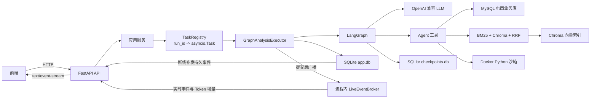
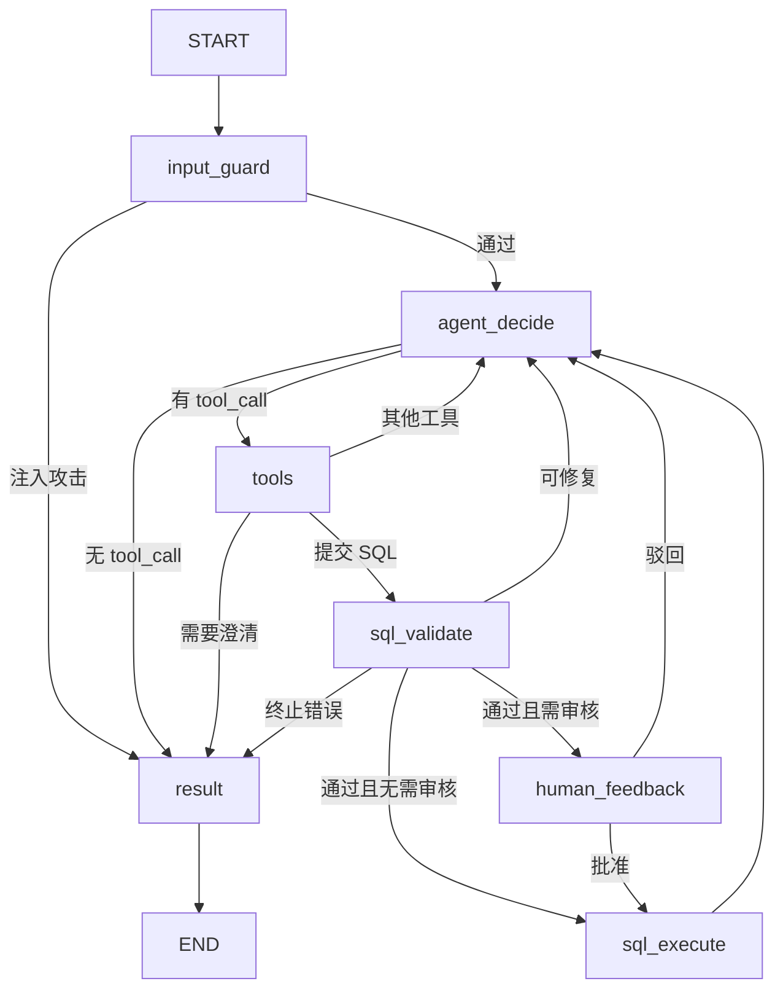
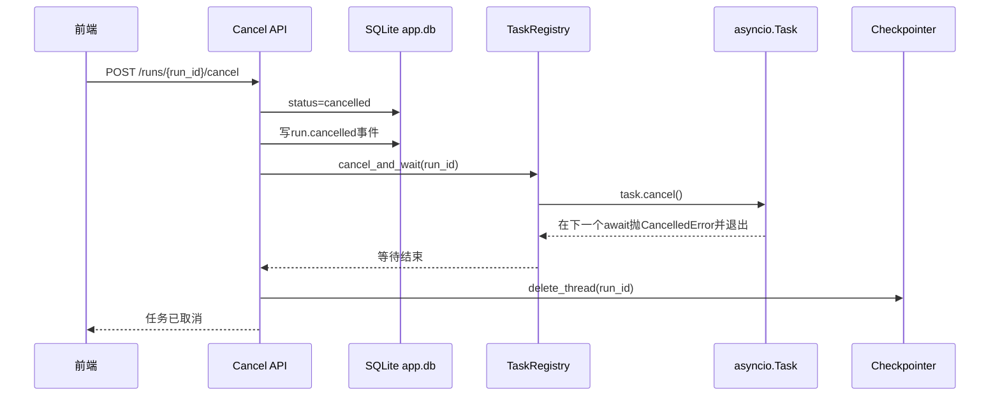
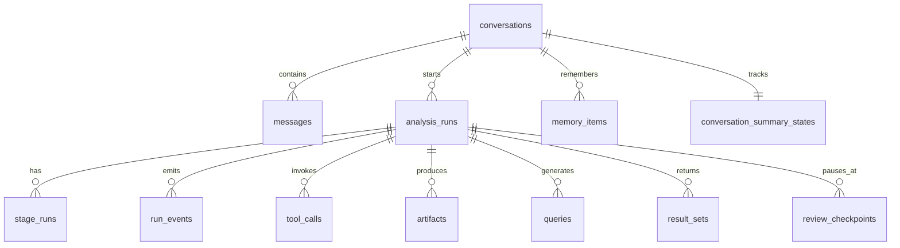
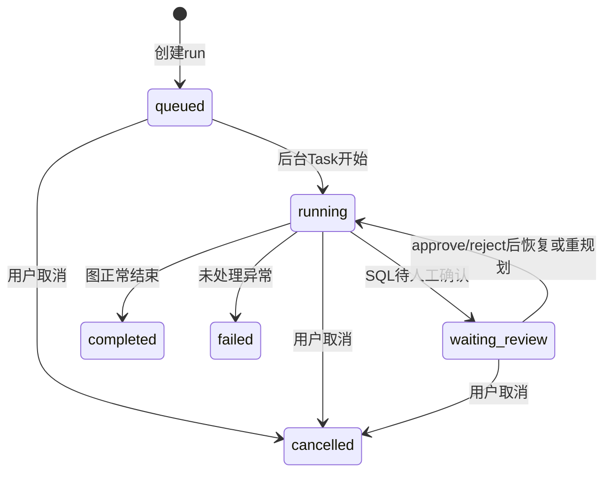
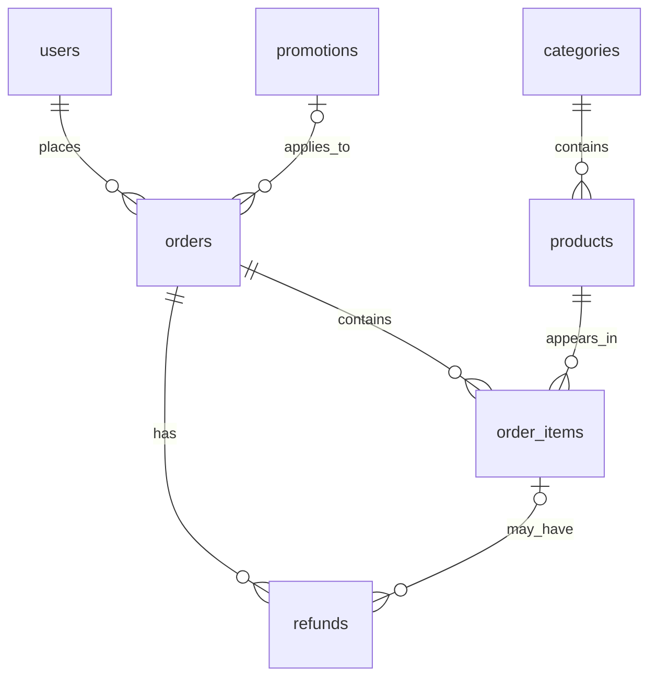

# DataAgent 代码级理解手册

> 目标：能够脱离代码讲清楚项目如何运行、每项技术为什么存在、状态保存在哪里、失败时如何处理，并且不再把 LangGraph、ReAct、Checkpoint、SSE、SQLite、Chroma 等概念混为一谈。
>
> 本文以当前 `data-agent-python-backend` 代码为准。凡是“设计上可以做到”但当前主链路没有接入的能力，都会明确标记，不能在面试中当成已完成能力。

配套阅读：

- 如果还不熟悉Python、FastAPI、异步和SQLAlchemy，先读[《Python零基础读代码指南》](./python-beginner-guide.md)；
- 如果正在排查真实问题，使用[《调试与故障排查手册》](./debug-playbook.md)；
- 准备面试追问时，再读[《校招面试问题与参考回答》](./interview-question-bank.md)。

---

## 0. 先记住这一句话

DataAgent 是一个面向电商经营分析的后端：FastAPI 接收自然语言问题，LangGraph 驱动一个带确定性护栏的 ReAct 循环，模型通过原生 Tool Calling 按需检索 Schema、执行只读 SQL、复用历史结果或调用 Docker 中的 Python 分析，运行过程和结果持久化到 SQLite，并通过 SSE 返回给前端。

这句话中每个名词的职责不同：

| 名词 | 在项目中的职责 | 不能误解成什么 |
|---|---|---|
| FastAPI | HTTP API、参数校验、SSE 响应 | 不负责 Agent 决策 |
| LangGraph | 节点编排、状态流转、条件路由、Checkpoint | 不等于 ReAct |
| ReAct | 模型观察上下文、选择工具、读取结果、继续决策的循环模式 | 不是一个替代 LangGraph 的框架 |
| OpenAI SDK | 真实 LLM 请求和原生 Tool Calling | 不是 LangGraph 自带模型 |
| SQLAlchemy + PyMySQL | 连接和查询 MySQL 业务数据库 | 不是 JDBC |
| SQLite `app.db` | 保存会话、消息、运行、事件、产物和结果预览 | 不保存销售业务明细 |
| SQLite `checkpoints.db` | 保存 LangGraph 的中间状态快照 | 不是聊天记录数据库 |
| MySQL `product_db` | 被分析的电商业务数据 | 不是 Agent 元数据仓库 |
| Chroma | 保存知识与实时 Schema 的向量索引 | 不是会话状态数据库 |
| SSE | 服务端向前端单向推送持久化事件 | 不是后台任务执行器 |
| `asyncio.Task` | 当前进程内真正运行一次分析任务 | 不是线程，也不是 Checkpoint |

---

## 1. 最重要的五个标识符

面试时最容易从这里开始混乱。

| 标识符 | 生命周期 | 用途 |
|---|---|---|
| `conversation_id` | 一段多轮会话 | 关联多条消息和多次分析运行 |
| `run_id` | 一次用户提问对应的一次运行 | 关联阶段、事件、工具调用、SQL、结果和错误 |
| LangGraph `thread_id` | 一次图执行的 Checkpoint 命名空间 | 当前代码直接使用 `run_id` 作为 `thread_id` |
| `tool_call_id` | 模型的一次工具调用 | 把 `AIMessage.tool_calls` 与对应 `ToolMessage` 配对 |
| `dataset_id` | 一次 SQL 查询形成的数据集 | 支持预览、分页、导出、历史复用和 Python 分析 |

必须准确表达：

```text
一个 conversation 可以包含多个 run。
一个 run 当前对应一个 LangGraph thread_id。
一个 run 可以调用多个 tool，也可以产生多个 dataset。
```

`thread_id` 只是 LangGraph 使用的逻辑标识，不是操作系统线程 ID，也不是 `ThreadLocal`。

---

## 2. 系统全景图



### 2.1 代码分层

| 层 | 目录 | 主要职责 |
|---|---|---|
| API 层 | `app/api/` | 路由、请求响应模型、SSE、错误转换 |
| 应用层 | `app/application/` | 创建运行、执行图、取消、审核、恢复、视图组装 |
| 工作流层 | `app/workflow/` | LangGraph、状态、节点、工具、提示词、模型上下文 |
| 领域层 | `app/domain/` | 状态枚举、错误、视图对象 |
| 基础设施层 | `app/infrastructure/` | SQLite、MySQL、OpenAI SDK |
| 检索层 | `app/retrieval/` | 切块、索引、BM25、Chroma、RRF、Schema 召回 |
| 记忆层 | `app/memory/` | 近期消息、滚动摘要、记忆抽取与检索实现 |
| 分析层 | `app/analysis/` | 结果集、历史结果、Python 代码生成与 Docker 执行 |
| 安全层 | `app/security/` | 提示注入检测、SQL AST 策略 |

---

## 3. 应用启动时发生什么

入口是 [`app/main.py`](../app/main.py)，生命周期顺序如下：

```text
配置日志
→ 初始化 SQLite app.db 表结构
→ GraphRuntime.startup()
→ 清理过期结果文件
→ 打开 AsyncSqliteSaver
→ 编译 LangGraph 并绑定 Checkpointer
→ 启动 Checkpoint 定时清理任务
→ 把服务重启前残留的 queued/running 运行标为 failed
→ 开始接收 HTTP 请求
```

关闭时顺序如下：

```text
取消所有进程内分析 Task
→ 关闭 GraphRuntime
→ 关闭 MySQL 连接池和 LLM 客户端
→ 关闭 Checkpointer
→ 关闭 SQLite
```

### 3.1 重启恢复的真实能力

当前 [`app/application/recovery.py`](../app/application/recovery.py) 并不会自动续跑普通分析任务。服务重启后：

- `queued` 和 `running` 被标记为 `failed`；
- `result_mode` 变成 `service_restarted`；
- 用户需要重新执行；
- 只有人工审核使用 Checkpoint 进行显式恢复。

因此不能说“所有任务都能在服务重启后断点续跑”。

---

## 4. 一次请求的完整生命周期

以用户提问“找出高销量低库存商品，并分析近三个月趋势”为例。

### 4.1 创建运行

前端先创建或选择一个会话，再调用：

```http
POST /api/v1/conversations/{conversation_id}/runs
```

请求体大致为：

```json
{
  "query": "找出高销量低库存商品，并分析近三个月趋势",
  "humanReviewEnabled": false,
  "idempotencyKey": "optional-key"
}
```

[`RunCommandService.create`](../app/application/run_commands.py) 做五件事：

1. 验证 `conversation_id` 存在；
2. 用 `idempotency_key` 防止重复创建；
3. 创建 `analysis_runs` 记录，初始状态为 `queued`；
4. 把问题写成一条 `user` 消息；
5. 调用 `task_registry.start(run.id, workflow.run(run.id))`。

API 返回 `202 Accepted`，表示“已接收”，不是“已完成”：

```json
{
  "runId": "run_xxx",
  "conversationId": "conv_xxx",
  "status": "queued",
  "eventsUrl": "/api/v1/runs/run_xxx/events"
}
```

### 4.2 后台 Task 真正开始工作

[`TaskRegistry`](../app/application/tasks.py) 内部维护：

```python
self._tasks: dict[str, asyncio.Task[None]]
```

逻辑关系为：

```text
run_xxx -> asyncio.Task(GraphAnalysisExecutor.run("run_xxx"))
```

`asyncio.create_task()`是在事件循环上调度协程，不会为每个请求创建一个操作系统线程。

### 4.3 执行器构造初始状态

[`GraphAnalysisExecutor.run`](../app/application/executor.py) 会：

1. 把运行改成 `running`；
2. 写入 `run.started` 事件；
3. 读取本会话历史消息；
4. 必要时触发滚动摘要；
5. 构造 `AnalysisState` 初始值；
6. 调用 `GraphRuntime.stream()`。

关键初始状态包括：

```python
{
    "run_id": run.id,
    "conversation_id": run.conversation_id,
    "query": run.question,
    "contextualized_query": run.question,
    "memory_context": memory_context,
    "human_review_enabled": run.human_review_enabled,
    "retry_count": 0,
    "agent_iterations": 0,
    "schema_search_count": 0,
    "sql_execution_count": 0,
    "observations": [],
    "query_results": [],
    "python_analyses": [],
}
```

注意：当前代码没有单独的“问题改写节点”，所以 `contextualized_query` 初始等于原问题，不能把它描述成一定经过了独立的上下文化改写。

### 4.4 LangGraph 开始运行

[`GraphRuntime.stream`](../app/workflow/runtime.py) 使用：

```python
config = {"configurable": {"thread_id": run_id}}
graph.astream(state, config=config, stream_mode=["custom", "updates"])
```

- `custom`：节点主动发送的阶段开始事件；
- `updates`：节点执行后产生的状态增量；
- Checkpointer 按 `thread_id=run_id` 保存图状态；
- Executor 消费这些更新并转成数据库记录和前端事件。

---

## 5. LangGraph、ReAct和确定性工作流的关系

这是项目最重要的架构问题。

### 5.1 当前图结构



### 5.2 哪些部分是 ReAct

`agent_decide → tools → agent_decide`构成 Agent Loop：

```text
模型观察当前上下文
→ 决定调用哪个工具
→ 工具返回 Observation
→ 模型观察新结果
→ 决定下一步
```

例如：

```text
search_schema
→ execute_sql
→ 根据结果再次 execute_sql
→ analyze_dataframe
→ finish
```

### 5.3 哪些部分不是交给模型自由决定

下面这些由代码强制执行：

- 输入注入检查；
- 没有 Schema 时禁止直接检查表或执行 SQL；
- SQLGlot 安全校验；
- 是否进入人工审核；
- SQL 真正执行；
- 最大 Agent、Schema 和 SQL 预算；
- 最终结果结构化和落库。

所以准确说法是：

> 项目使用 LangGraph 编排一个混合式 Agent。开放性的分析路径由 ReAct + Tool Calling 决定，安全和副作用环节由确定性节点控制。

这比“完全让模型自由发挥”准确，也比“固定工作流”灵活。

---

## 6. AnalysisState到底是什么

[`AnalysisState`](../app/workflow/state.py) 是一次图运行期间的共享状态契约。节点不直接修改全局对象，而是返回状态增量，LangGraph负责合并。

唯一使用 reducer 的字段是：

```python
messages: Annotated[list[AnyMessage], add_messages]
```

它会追加和合并消息。其他普通字段通常由新值覆盖；列表是否累加需要节点自己写：

```python
"query_results": [*state.get("query_results", []), query_result]
```

### 6.1 三类状态不能混淆

| 状态 | 保存位置 | 目的 | 生命周期 |
|---|---|---|---|
| `AnalysisState` | LangGraph运行内存 + Checkpoint | 节点间传递工作流状态 | 单次run |
| 业务运行记录 | SQLite `app.db` | 前端展示、审计、历史查询 | 持久保存 |
| `TaskRegistry` | 当前Python进程内存Map | 找到并取消正在执行的协程 | 进程生命周期 |

Checkpoint不是业务数据库，TaskRegistry也不是会话记忆。

---

## 7. Agent上下文是如何构造的

不能把整个`AnalysisState`直接发给模型，因为其中可能包含完整Schema、历史结果和大量工具消息。

[`AgentContextBuilder`](../app/workflow/context_builder.py) 会投影出模型真正看到的内容：

```text
当前问题
+ 近期原始对话
+ 滚动摘要
+ 当前计划
+ 裁剪后的Schema
+ 裁剪后的业务知识
+ 当前结果预览
+ 最近结果目录
+ 最近8条Observation
+ Python分析结果
+ 当前Agent预算
```

完整Schema仍在State中，但发送给模型时受`context_schema_token_budget`限制。Schema工具消息还会压缩成表名和`state.schema`引用，避免同一份列定义重复进入上下文。

模型请求之前，[`OpenAiChatClient`](../app/infrastructure/llm/openai.py)还会：

1. 对超长ToolMessage截断；
2. 估算系统提示、消息和工具Schema的总Token；
3. 超过`max_context_size`直接报错；
4. 记录模型输入、输出、Token使用量和耗时。

Token估算不是服务端返回值，而是客户端启发式：中文大约1字1 Token，ASCII大约4字符1 Token。真正请求完成后，日志再记录API返回的`prompt_tokens`和`completion_tokens`。

---

## 8. 原生Tool Calling如何工作

工具定义在 [`app/workflow/tools.py`](../app/workflow/tools.py)，使用LangChain的`@tool`。

### 8.1 当前工具清单

| 工具 | 用途 | 是否产生副作用 |
|---|---|---|
| `update_analysis_plan` | 记录复杂任务目标和步骤 | 更新Graph State |
| `ask_clarification` | 缺少决定性条件时询问用户 | 结束当前run |
| `search_schema` | 从真实MySQL Schema召回相关表 | 更新Schema State/Chroma Schema索引 |
| `inspect_tables` | 精确读取指定表完整结构 | 更新Schema State |
| `retrieve_knowledge` | 检索业务文档 | 只读 |
| `execute_sql` | 提交候选SQL | 只设置待校验标记，不直接执行 |
| `search_analysis_history` | 搜索当前会话历史结果 | 只读 |
| `inspect_query_result` | 分页读取历史数据集 | 只读 |
| `search_conversation_history` | 搜索其他会话 | 只读 |
| `read_conversation_history` | 读取指定历史会话消息 | 只读 |
| `search_current_conversation` | 搜索当前会话被摘要覆盖的原始消息 | 只读 |
| `read_message_context` | 读取命中消息及前后语境 | 只读 |
| `analyze_dataframe` | 在Docker中分析SQL结果 | 执行隔离代码并产生分析产物 |
| `rewrite_core_memory` | 用户明确要求时改写核心记忆 | 写SQLite |

### 8.2 为什么execute_sql工具不直接执行

模型只能提交候选：

```python
{
    "sql": sql,
    "pending_sql_validation": True,
}
```

图随后强制进入`sql_validate`。验证通过后才可能进入`human_feedback`和`sql_execute`。

这条边界非常关键：模型有“建议SQL”的能力，没有“绕过安全策略直接查询数据库”的能力。

### 8.3 模型没有调用工具时会发生什么

`complete_tool_messages()`返回一个`AIMessage`：

- 有`tool_calls`：进入tools节点；
- 无`tool_calls`：视为`finish`，进入result节点；
- 全程没有查询结果：通常标为`conversation`模式，而不是数据分析成功。

### 8.4 所有工具共用的执行机制

工具函数的签名中同时存在两类参数：

```python
async def search_schema(
    query: str,                                      # 模型生成
    state: Annotated[AnalysisState, InjectedState], # LangGraph注入
    tool_call_id: Annotated[str, InjectedToolCallId],# LangGraph注入
) -> Command:
```

- `query`、`sql`、`tables`等业务参数会出现在提供给模型的JSON Schema中；
- `state`和`tool_call_id`由LangGraph注入，不允许模型伪造；
- `specifications()`使用`tool_call_schema`生成模型可见定义，主动排除注入参数；
- OpenAI请求设置`parallel_tool_calls=False`，当前Agent每轮只处理一个工具调用。

工具通常不直接修改传入的字典，而是通过`_command()`返回状态增量：

```text
Command
└─ update
   ├─ 本工具需要更新的State字段
   └─ messages
      └─ ToolMessage(tool_call_id=原调用ID, content=JSON结果)
```

`ToolMessage`的作用是把工具观察结果送回模型，并用`tool_call_id`证明它在回答哪一次调用。随后图从`tools`节点回到`agent_decide`，模型观察结果再决定下一步。

完整审计顺序为：

```text
模型返回Tool Call
→ Executor向tool_calls写pending记录和完整参数
→ LoggingToolNode记录调用日志
→ ToolNode执行工具
→ 工具返回Command + ToolMessage
→ Executor把ToolMessage保存到tool_calls.result_json并标记success
→ 写tool.completed事件
→ 根据State标记路由到agent_decide、sql_validate或result
```

如果工具抛出未处理异常，run进入`failed`，Executor会把仍为`pending`的工具调用标记为`failed`。需要注意：工具调用成功只代表“工具函数正常返回”，不代表后续业务一定成功。例如`execute_sql`工具成功仅表示候选SQL已提交，真实SQL可能在后续校验或执行阶段失败。

当前还有一个审计边界：LangGraph若把参数校验错误转换成`ToolMessage(status="error")`，Executor目前没有检查该`status`，仍可能调用`complete_tool_call()`把记录保存为`success`。这不会绕过SQL安全节点，但会让`tool_calls.status`失真；后续应根据ToolMessage状态分别调用complete或fail，并补对应测试。

### 8.5 `update_analysis_plan`：记录计划，不执行计划

**模型参数**：`goal`、`steps`。

实现过程：

1. 最多接收前10个步骤；
2. 每个步骤归一化为`id/title/objective`；
3. 缺少ID时生成`step_01`一类编号；
4. 如果State中存在人工驳回意见，加入`review_feedback`；
5. 写入`state.plan`并追加observation。

它不会创建独立任务、不会按照steps自动循环、也不会生成SQL。真正的下一步仍由下一轮`agent_decide`决定。计划之后会被Executor保存为`plan` Artifact，主要用于模型自我约束、前端展示和审核。

### 8.6 `ask_clarification`：正常结束为追问结果

**模型参数**：`question`。

工具将：

```text
final_answer = question
result_mode = need_clarification
```

图检测到该模式后从`tools`进入`result`，最终run通常是`status=completed`、`result_mode=need_clarification`。它不是抛异常，也不会创建人工审核记录。系统提示要求只有在检索Schema和知识后仍缺少决定性条件时才使用，但这项调用时机主要依赖模型遵守工具描述。

### 8.7 `search_schema`：从真实库结构中召回候选表

**模型参数**：`query`。

实现链路：

```text
BusinessDatabase.schema_snapshot()
→ 读取真实MySQL表、列、注释和外键
→ KnowledgeRetriever.search_schema(query, full_schema)
→ 每张表构造成检索文档
→ BM25与Chroma召回并用RRF融合
→ 取初始Top-K
→ 补充直接外键邻居
→ 不超过max_tables
```

写入State：

- `full_schema`：完整数据库结构；
- `schema`：当前选中的表结构；
- `selected_tables`：表名列表；
- `schema_reasons`：混合检索命中或关联扩展原因；
- `schema_search_count + 1`：预算计数。

首次Schema指纹变化时会把表级检索文档同步到Chroma。若召回为空，当前实现会取前若干张表兜底，因此`ok=True`不一定表示语义召回质量良好。Executor还会保存`schema_snapshot`和`retrieval` Artifact。

### 8.8 `inspect_tables`：按表名补充精确结构

**模型参数**：`tables: list[str]`。

该工具不做模糊检索，而是从`state.full_schema`中按真实表名精确筛选；如果完整结构尚未加载，会重新调用`schema_snapshot()`。命中的表与现有`state.schema`按表名合并，更新`selected_tables`。

典型用途是先通过`search_schema`找到`orders`，模型发现还需要`order_items`后再精确读取。不存在的表不会被编造，工具会返回`ok=False + 请求的表不存在`。当前匹配区分字符串内容，不会替模型纠正拼写。

### 8.9 `retrieve_knowledge`：召回业务口径

**模型参数**：`query`。

`KnowledgeRetriever.search()`分别检索documents和evidences：有Chroma时走BM25 + 向量 + RRF，没有Chroma时走纯BM25；最后分别按配置Top-K截断。结果整体写入`state.knowledge`，Executor保存`knowledge_retrieval` Artifact。

它不会读取MySQL业务行，也不会修改Schema。它解决的是“GMV包含哪些订单状态”“退款使用哪个时间字段”这类业务语义问题。

### 8.10 `execute_sql`：只提交候选SQL

**模型参数**：`sql`。

工具本身只执行：

```text
state.sql = 模型生成的SQL
state.pending_sql_validation = true
```

`tools`节点随后强制路由到`sql_validate`：

```text
SQLGlot解析
→ 单条SELECT检查
→ 系统表与危险函数检查
→ SELECT *检查
→ 已召回表字段白名单
→ JOIN条件
→ 敏感字段
→ 强制LIMIT
→ 可选人工审核
→ sql_execute真正查询MySQL
```

真实执行成功后才会创建CSV Dataset、`result_sets`、`queries`和查询Artifact。`tool_calls`中`execute_sql=success`只表示候选提交成功；判断SQL是否执行成功必须继续查看`queries.status`、`query.result`事件和run状态。

### 8.11 `search_analysis_history`：搜索当前会话的历史结果

**模型参数**：`query`、可选`scope`、`limit`。

工具把范围固定为`state.conversation_id`，最多返回10条。`ResultHistoryService`先查询`result_history_fts`，没有命中时再对`analysis_runs.question`和`queries.sql`做关系型模糊匹配。返回的是结果目录：`datasetId`、原问题、SQL、列名、行数和时间，不会一次返回全部数据行。

`scope`会被归一化为`query_results/analyses/all`，但当前`ResultHistoryService.search()`尚未真正按scope分支，因此它目前是预留参数，不能宣称已经支持多种搜索范围。

### 8.12 `inspect_query_result`：分页读取某个历史结果

**模型参数**：`dataset_id`、可选`offset`、`limit`。

工具通过`result_sets → analysis_runs`校验该Dataset属于当前会话，防止用任意ID读取其他会话结果。`limit`被限制在1到50：CSV仍存在时分页读取完整结果；CSV过期后只能读取SQLite中的预览。

找不到或不属于当前会话时，它不抛顶层异常，而是返回：

```json
{"ok": false, "error": "result_not_found", "retryable": false}
```

模型应据此停止使用错误ID或重新搜索历史结果。

### 8.13 `search_conversation_history`：搜索其他会话目录

**模型参数**：`query`、可选`limit`。

工具新建请求外的短生命周期`AsyncSession`，查询`conversation_history_fts`。检索词只保留长度至少3的部分，多词使用AND，候选按FTS rank排序后按会话去重，最多返回10个会话的ID、标题和命中片段。

它只返回目录，不返回完整聊天内容。当前项目按本地单用户设计，没有用户/租户字段；如果改成多用户服务，必须先增加所有权条件，不能直接复用现有跨会话查询。

### 8.14 `read_conversation_history`：读取选中的历史会话

**模型参数**：`conversation_id`、可选`limit`。

Repository读取目标会话的标题、滚动摘要和消息，只保留`user/assistant`角色，并取最近1到50条。工具通常应在`search_conversation_history`拿到候选ID后调用。

它不会把读取内容自动写入当前会话的持久化历史，只通过本轮`ToolMessage`交给模型。当前同样没有用户所有权校验，这是单用户本地部署假设，不是生产级多租户实现。

### 8.15 `analyze_dataframe`：对已有SQL结果做隔离分析

**模型参数**：`objective`、可选`dataset_ids`。

前置条件是当前State已经有`query_results`。实现链路：

```text
选择当前run中的Dataset
→ 校验总行数不超过python_analysis_max_rows
→ 优先复制完整CSV，没有CSV时写出预览
→ LLM生成受约束Python代码
→ 静态检查导入、文件路径和危险调用
→ Docker无网络、非root、只读根目录、CPU/内存/PID/超时限制
→ 读取并校验result.json
→ 失败时把错误交给模型修复，最多配置次数
```

成功后追加到`state.python_analyses`，Executor保存`python_analysis` Artifact。工具捕获分析异常并返回`ok=False`，当前标记`retryable=False`，所以失败不一定让整个run失败，模型可以改用已有SQL结果总结。

### 8.16 `rewrite_core_memory`：整块改写跨会话核心记忆

**模型参数**：`instruction`。

工具读取`profile_id=default`对应的当前核心记忆，把旧记忆、用户本轮原话和修改指令交给LLM生成结构化新版本，然后执行两项确定性校验：

1. 正则拦截密码、API Key和访问令牌；
2. 不超过`core_memory_max_tokens`。

只有模型声明内容变化且文本确实不同才写入`user_core_memory`。新建会话时会把该记忆快照作为隐藏System Message注入；已存在会话不会自动刷新旧快照。该工具适用于“以后都按华东区统计”一类明确长期偏好，不应用于一次性查询条件。

### 8.17 一张表看清每个工具之后去哪

| 工具 | 主要State变化 | 下一步通常是 |
|---|---|---|
| `update_analysis_plan` | `plan` | `agent_decide` |
| `ask_clarification` | `final_answer/result_mode` | `result` |
| `search_schema` | `full_schema/schema/selected_tables` | `agent_decide` |
| `inspect_tables` | 合并`schema/selected_tables` | `agent_decide` |
| `retrieve_knowledge` | `knowledge` | `agent_decide` |
| `execute_sql` | `sql/pending_sql_validation` | `sql_validate` |
| `search_analysis_history` | 结果只在`ToolMessage` | `agent_decide` |
| `inspect_query_result` | 数据只在`ToolMessage` | `agent_decide` |
| `search_conversation_history` | 目录只在`ToolMessage` | `agent_decide` |
| `read_conversation_history` | 消息只在`ToolMessage` | `agent_decide` |
| `analyze_dataframe` | `python_analyses` | `agent_decide` |
| `rewrite_core_memory` | SQLite核心记忆；结果在`ToolMessage` | `agent_decide` |

---

## 9. RAG完整流程

项目中有两种检索对象：

1. 离线业务文档；
2. 实时MySQL Schema。

两者都能使用BM25 + Chroma + RRF，但索引来源和更新时间不同。

### 9.1 离线索引阶段

入口命令：

```bash
data-agent-index-knowledge
```

流程：

```text
读取 Markdown/TXT
→ Markdown按标题层级切分
→ 每个标题下按段落切分
→ 超过512 Token的段落递归按句子/标点切分
→ 仅超长段使用64 Token overlap
→ 标题路径 + 正文形成 retrievalText
→ BGE-M3生成向量
→ 写入Chroma
→ SQLite manifest记录文件哈希和chunk
```

为什么普通段落不Overlap：它本身是完整语义单元，重叠只会制造重复候选。为什么超长段Overlap：被迫切开时，需要保留切分边界上下文。

Manifest通过文件哈希做增量索引：文档没变就跳过，改变后只替换对应Chunk，删除源文件时同步删除旧向量。

### 9.2 BM25词法召回

BM25适合精确术语、表名、字段名和业务关键词。简化公式为：

\[
score(D,Q)=\sum_{q\in Q} IDF(q)\cdot
\frac{tf(q,D)(k_1+1)}{tf(q,D)+k_1(1-b+b\frac{|D|}{avgdl})}
\]

- `tf`：词在文档中的频率；
- `IDF`：词越少见，区分度越高；
- `|D|/avgdl`：文档长度归一化；
- 它不是只考虑“词频和文档长度”，还包含逆文档频率。

### 9.3 Chroma向量召回

Chroma使用余弦距离。代码转换为相似度：

\[
similarity = 1 - cosineDistance
\]

只有`similarity >= recall_vector_min_score`的候选保留，当前默认阈值为`0.25`。

向量检索适合用户表达与文档用词不同但语义相近的情况。

### 9.4 RRF融合

BM25分数和向量相似度不在同一尺度，因此当前没有直接加权分数，而是按排名融合：

\[
RRF(d)=\sum_{r\in\{BM25,Vector\}}\frac{1}{k+rank_r(d)}
\]

当前`k=10`。候选数先放大到`topK × 4`，融合后再截断。

必须记住：

- RRF是排序融合算法；
- 当前没有独立Cross-Encoder reranker；
- 不能把RRF描述成“取两路分数平均”；
- 不能在简历里写“rerank模型”而代码中没有模型重排。

### 9.5 Metadata过滤

Chroma查询时使用：

```python
where={"kind": kind}
```

不同数据类型不会互相挤占候选：

| kind | 数据 |
|---|---|
| `knowledge_chunk` | 离线业务文档Chunk |
| `schema_table` | 实时数据库表结构 |
| `document`/`evidence` | 兼容旧索引格式 |

### 9.6 Schema召回

每次调用`search_schema`：

```text
SQLAlchemy Inspector读取MySQL所有表、列、注释和外键
→ 每张表转成一条可检索文本
→ 构建临时BM25索引
→ Schema变化时同步schema_table到Chroma
→ BM25与向量召回初始Top 4
→ RRF融合
→ 按外键扩展一跳邻居
→ 总表数最多8张
```

`recall_schema_top_k=4`不是“最多只能四表联查”。外键扩展后最多8张，Agent还可以调用`inspect_tables`补充指定表。

当前代码存在“无召回时取前几张表兜底”的逻辑。这能避免空Schema，但也可能把无关表交给模型，是需要通过日志和评测继续观察的设计取舍。

---

## 10. SQL生成、校验和执行

### 10.1 SQL不是独立节点生成的

当前没有单独的`sql_generate`节点。模型在`agent_decide`中通过原生Tool Calling调用：

```json
{
  "name": "execute_sql",
  "arguments": {"sql": "SELECT ..."}
}
```

因此SQL生成发生在Agent决策中，真正执行发生在确定性的`sql_execute`节点。

### 10.2 SQLGlot校验顺序

[`inspect_select_sql`](../app/security/sql_policy.py)把SQL解析成AST，依次检查：

1. 只能是一条查询语句；
2. 禁止DELETE、UPDATE、INSERT、CREATE、DROP、ALTER等节点；
3. 禁止访问系统库；
4. 禁止身份、版本、会话和延迟函数；
5. 禁止`SELECT *`；
6. 表必须在召回Schema白名单中；
7. 字段必须真实存在；
8. JOIN必须带ON或USING，显式CROSS JOIN除外；
9. 敏感字段不能返回明细，COUNT聚合允许；
10. LIMIT缺失或过大时自动改写为最大行数。

### 10.3 为什么还要数据库层保护

AST校验不是唯一防线。`BusinessDatabase`还会：

- 设置MySQL Session为只读；
- 设置`MAX_EXECUTION_TIME`；
- 配置连接读写超时；
- 通过SQLAlchemy连接池复用连接；
- 最多读取`sql_row_limit`行；
- 使用root账号时输出告警。

生产环境仍应使用只拥有SELECT权限的数据库账号。应用层校验不能代替数据库最小权限。

### 10.4 SQL失败如何修复

执行或校验失败后，错误会写成Observation返回Agent。下一轮模型可以重新检索Schema或提交修复后的SQL。

预算是分开的：

- `agent_max_iterations`：总决策轮数；
- `agent_max_schema_searches`：Schema检索次数；
- `agent_max_sql_executions`：SQL执行次数；
- `agent_max_sql_repairs`：可重试SQL校验失败次数；
- `python_analysis_max_repairs`：Python代码修复次数。

当前前三项默认值是50，属于很宽松的开发配置，不能在面试中把它包装成合理的生产参数。合理做法应根据评测统计收紧，并配合总耗时、Token和成本预算。

---

## 11. 人工审核和Checkpoint

启用`human_review_enabled`后，SQL通过校验不会立即执行，而是进入：

```python
interrupt({"sql": ..., "plan": ..., "safety": ..., "tables": ...})
```

### 11.1 暂停时发生什么

```text
LangGraph执行到human_feedback
→ interrupt产生__interrupt__
→ Checkpointer保存当前AnalysisState
→ Executor创建review记录
→ run.status变为waiting_review
→ SSE发送review.required
→ 本次后台Task自然结束
```

### 11.2 审核通过

```text
POST /reviews/{id}/approve
→ review改为approved
→ run重新改为running
→ 创建新的asyncio.Task
→ GraphRuntime.resume(run_id, approved=True)
→ Command.resume把反馈送回中断节点
→ 从Checkpoint继续到sql_execute
```

### 11.3 审核驳回

驳回意见同样通过`Command.resume`送回图，`human_feedback`节点把意见写入plan，再路由回`agent_decide`重新规划。

Checkpoint解决的是“图在哪里暂停、如何继续”，不是多轮聊天记忆，也不是取消任务。

---

## 12. 多轮会话和上下文压缩

### 12.1 当前真正接入的能力

每个run开始前，[`ContextBuilder`](../app/memory/context.py)读取当前会话全部消息，并排除本轮刚写入的用户消息，避免重复。

模型上下文由两部分构成：

```text
持久化滚动摘要 + 摘要游标之后的近期原始消息
```

### 12.2 什么时候触发摘要

不是固定10轮，也不是固定保留3轮。当前按Token压力触发：

\[
pressure = tokens(existingSummary) + tokens(unsummarizedMessages)
\]

当：

\[
pressure \ge memoryContextBudget \times compactThreshold
\]

才执行摘要。

当前默认：

```text
memory_context_token_budget = 65,536
context_compact_threshold = 0.8
触发点约为 52,428 Token
context_compact_preserve_ratio = 0.3
近期原文保留预算约为 19,660 Token
```

达到阈值后：

```text
找到尚未摘要的消息
→ 从最新消息向前保留约30%预算的原文
→ 更早消息与existingSummary一起发给LLM
→ 保存新summary
→ 保存last_message_id摘要游标
→ 后续上下文不再重复加入游标之前的原始消息
```

原始消息仍在SQLite，不会因为摘要而删除。摘要只是模型上下文压缩，不是数据删除。

### 12.3 当前尚未真正接入的记忆能力

这是防止简历和面试夸大的重点：

| 能力 | 代码是否存在 | 主请求链路是否使用 |
|---|---:|---:|
| 近期原始消息 | 是 | 是 |
| Token压力触发的滚动摘要 | 是 | 是 |
| 同会话历史结果目录 | 是 | 是 |
| Agent主动搜索历史会话 | 是 | 是，通过工具按需调用 |
| `MemoryProvider`向量检索 | 是 | 否，默认`memory_backend=none` |
| `LongTermMemoryExtractor`自动抽取 | 是 | 否，只在Runtime中实例化，Executor未调用 |
| `memory_ttl_days`和容量淘汰 | 仓储方法存在 | 否，主流程未调用 |
| `rewrite_core_memory`显式改写 | 是 | 可由Agent调用并写库 |
| 核心记忆注入新会话 | 是 | 是，新建会话时写入隐藏System Message |
| 已存在会话自动刷新核心记忆 | 否 | 否，改写后不会替换旧会话中的System Message快照 |

因此当前准确描述应是：

> 已实现基于会话ID的消息持久化、近期原文和Token压力触发的滚动摘要，并支持Agent按需搜索历史会话与历史查询结果。用户明确要求记忆时，Agent可改写核心记忆，新建会话会注入其快照；自动抽取、向量检索、TTL淘汰以及已存在会话的自动刷新尚未接入主链路。

不能直接说“已经实现完整的多层长期记忆系统”。

---

## 13. 查询结果为什么要变成Dataset

如果把5万行SQL结果直接塞进模型上下文，会造成：

- Token爆炸；
- LLM成本和延迟上升；
- 前端无法分页；
- 后续追问无法可靠引用；
- Python分析无法读取完整数据。

所以SQL成功后，[`AnalysisDatasetStore`](../app/analysis/datasets.py)会：

```text
最多保留50,000行
→ 完整结果原子写入CSV
→ SQLite result_sets只保存列信息、前50行预览和文件路径
→ 返回dataset_id
```

不同消费者读取不同范围：

| 消费者 | 数据量 |
|---|---:|
| Agent当前上下文 | 默认20行 |
| SQLite预览 | 默认50行 |
| 历史结果inspect | 单次最多50行 |
| 前端分页 | 单页最多500行 |
| Python分析 | 最多50,000行完整CSV |
| 导出 | 文件有效时读取完整CSV |

CSV默认保留168小时，目录配额默认512MB。过期后删除CSV，只保留SQLite预览，此时不能再导出完整结果。

### 13.1 多次SQL结果如何合并

一个run可以产生多个`query_results`。最终结果节点会读取每个数据集最多50行，并把所有结果一起交给结果模型，而不是只解释最后一条SQL。

最终结构包括：

```text
title
summary
findings[]
metrics[]
charts[]
```

每个指标、发现和图表引用实际`resultSetId`。没有真实列的图表会被过滤，减少模型编造字段。

---

## 14. Python分析如何运行

Agent只有在已有SQL数据，并且任务需要趋势、异常、相关性或多结果集合并时，才应调用`analyze_dataframe`。

流程：

```text
选择dataset_id
→ 从result_sets找到完整CSV
→ 给LLM数据集Schema、样例和分析目标
→ LLM生成完整Python脚本
→ 静态检查危险导入、危险调用和非法路径
→ Docker启动一次性容器
→ pandas读取只读CSV
→ 输出result.json
→ 校验metrics/findings/charts
→ 失败时最多修复2次
→ 合并进最终分析
```

Docker限制包括：

- 无网络；
- 只读根文件系统；
- 非root用户；
- 丢弃Linux capabilities；
- 禁止提权；
- CPU、内存、进程数和超时限制；
- 输入只读挂载，只有输出目录可写。

这不是“把完整结果存进Docker”。完整结果先保存为CSV，Docker只是按需挂载读取并执行分析。

---

## 15. SSE、事件和前端实时性

当前SSE采用“持久事件 + 进程内实时广播”的双通道设计：

```text
持久事件：
LangGraph update → Executor → 写入 run_events → commit成功 → LiveEventBroker广播

瞬时事件：
LLM Token增量 → LangGraph custom stream → LiveEventBroker广播，不写run_events

SSE连接：
先订阅Broker → 再按Last-Event-ID从run_events补历史 → 接收Broker新事件 → 按seq去重
```

常见事件包括：

```text
run.started
stage.started
agent.decision
tool.completed
stage.completed
query.result
text.delta
review.required
run.completed
run.failed
run.cancelled
```

### 15.1 为什么先持久化再SSE

- 前端刷新后仍能恢复过程；
- `Last-Event-ID`支持断线续传；
- 运行和展示解耦；
- 可以审计模型调用和工具执行；
- 没有在线SSE订阅时任务仍能完成。

### 15.2 它是不是Token级实时输出

当前用户可见的最终回答已经使用OpenAI兼容接口的`stream=True`接收真实文本增量，并通过`final_answer.delta`瞬时广播。工具调用、阶段状态和最终结果仍会形成持久事件或Artifact。

需要区分两类数据：

- `final_answer.delta`是低延迟Token增量，只存在于当前进程的订阅队列中，断线期间不会逐Token补发；
- `run_events`中的阶段事件和最终`text.delta`可以按`seq`补发，最终完整回答也能从run详情、消息和Artifact恢复。

因此可以说“最终回答支持Token级流式输出，运行过程支持持久化事件续传”，但不能说“模型思考过程全部逐Token持久化”。

---

## 16. 取消任务到底如何实现

取消不是Checkpoint，也不是关闭SSE。

### 16.1 正常取消路径



`task.cancel()`是协作式取消：它向协程注入`asyncio.CancelledError`，通常在下一次`await`处生效。

取消前先把数据库状态改为`cancelled`，而Executor在写阶段、完成和失败前都会检查该状态，所以迟到的节点结果不会把取消状态覆盖为`completed`。

### 16.2 SSE断开为什么不自动取消

```text
关闭页面/网络断开 → SSE生成器退出 → 后台Task继续
```

这样用户切换页面不会丢失分析，重新进入后可以从持久化事件续传。只有用户明确点击取消才调用Cancel API。

### 16.3 当前取消机制的边界

| 正在执行的操作 | 取消效果 |
|---|---|
| 异步等待LLM HTTP请求 | 通常会随协程取消 |
| LangGraph节点之间 | 能在await边界退出 |
| `asyncio.to_thread`中的同步SQL | 外层协程退出，但底层线程不能被Python强杀，只能依靠SQL超时 |
| Docker子进程 | 当前没有捕获CancelledError并显式kill，容器可能继续短暂运行 |
| 多进程部署 | TaskRegistry只认识本进程Task，取消请求落到其他进程时无法找到 |

所以当前是单进程、协作式取消，不是生产级分布式任务撤销。

---

## 17. 暂停、取消、失败、重试和断线的区别

| 场景 | 运行状态 | 后台Task | Checkpoint | 能否继续 |
|---|---|---|---|---|
| SSE断线 | 不变 | 继续 | 保留 | 重新订阅事件 |
| 人工审核暂停 | `waiting_review` | 当前Task结束 | 保留 | approve/reject后resume |
| 用户取消 | `cancelled` | `task.cancel()` | 删除 | 不能resume，只能新建run |
| 节点异常 | `failed` | 结束 | 暂存24小时 | 当前实现通过retry新建run |
| 服务重启 | 残留run改为`failed` | 原Task已消失 | 可能仍有 | 当前不自动续跑 |
| 用户重试 | 新run | 新Task | 新thread_id | 与旧run通过`retry_of_run_id`关联 |

---

## 18. 异步、线程和进程是怎么配合的

### 18.1 主要执行环境

```text
FastAPI/Uvicorn事件循环
├── HTTP请求协程
├── 每个分析run的asyncio.Task
├── OpenAI异步HTTP请求
├── SQLite异步会话
├── SSE订阅与事件补发协程
└── Checkpoint清理Task
```

### 18.2 什么时候切到线程池

同步阻塞库通过`asyncio.to_thread()`执行：

- SQLAlchemy同步MySQL查询和Schema Inspector；
- Chroma查询；
- BM25 + RRF混合检索；
- CSV读写；
- 部分记忆索引操作。

这时执行线程可能变化，但业务状态不依赖ThreadLocal，而是显式通过`AnalysisState`、`run_id`和数据库传递。

### 18.3 什么时候创建独立进程

Python分析通过`asyncio.create_subprocess_exec("docker", "run", ...)`启动Docker CLI和容器进程。它不在FastAPI事件循环或线程池里执行用户生成的Python代码。

---

## 19. 数据到底保存在哪里

项目没有把所有数据塞进一个数据库，而是按职责拆分：MySQL保存销售事实，SQLite保存Agent运行和会话状态，Chroma保存向量索引，CSV保存大结果集，LangGraph自己的SQLite保存图执行快照。

### 19.0 先分清四个数据边界

| 边界 | 核心问题 | 权威数据源 |
|---|---|---|
| 销售业务 | 用户买了什么、订单金额多少、是否退款 | MySQL `product_db` |
| Agent应用 | 用户问了什么、run进行到哪里、执行了什么SQL | SQLite `app.db` |
| 图执行恢复 | LangGraph暂停前的State和待提交写入是什么 | SQLite `checkpoints.db` |
| 检索与大文件 | 文档如何被搜索、完整结果保存在哪里 | Chroma、清单库、CSV |

这里的“权威数据源”表示发生冲突时应该信谁。例如订单金额以MySQL为准，不能以LLM总结或Artifact为准；run状态以`analysis_runs`为准，不能以某个仍留在内存中的Task对象为准。

从领域关系看，`Conversation`是一段长期会话，`AnalysisRun`是会话内的一次分析尝试。一个会话可以有多个run；一个run可以调用多个工具、执行多条SQL、产生多个结果集和Artifact。`Run`不是`Conversation`，`Query`也不是`Run`。

### 19.1 SQLite `app.db`：Agent应用数据

#### 会话与消息

| 表 | 一行代表什么 | 主要字段 |
|---|---|---|
| `conversations` | 一个用户会话 | `id`、`title`、`agent_id`、`datasource_id`、`summary`、`status`、`last_run_id`、创建/更新时间 |
| `messages` | 会话中的一条用户或助手消息 | `id`、`conversation_id`、`run_id`、`role`、`content`、`content_type`、`created_at` |
| `conversation_summary_states` | 一个会话的摘要进度 | `conversation_id`、摘要截至的`last_message_id`、`summarized_message_count`、`updated_at` |

例如用户在会话`conv_01`里问“按渠道统计订单量”，`messages`会新增一行：

```text
id=msg_01
conversation_id=conv_01
run_id=run_01
role=user
content=按渠道统计订单量
content_type=markdown
```

`conversation_id`表示消息属于哪个会话，`run_id`表示这条消息由哪次分析运行产生或触发。它们不是操作系统线程ID。

#### 运行、阶段与事件

| 表 | 一行代表什么 | 主要字段 |
|---|---|---|
| `analysis_runs` | 一次完整分析请求 | `id`、`conversation_id`、`retry_of_run_id`、`idempotency_key`、`question`、`contextualized_question`、`status`、`result_mode`、`current_stage`、人工审核开关、耗时和错误信息 |
| `stage_runs` | 某次运行中某个阶段的一次尝试 | `run_id`、`stage`、`attempt`、`status`、`message`、开始/完成时间、耗时和错误；`run_id + stage + attempt`唯一 |
| `run_events` | 一条可通过SSE回放的运行事件 | `conversation_id`、`run_id`、`seq`、`type`、`stage`、`data`、`created_at`；同一run内`seq`唯一 |

一次请求只产生一行`analysis_runs`，但会产生多行`stage_runs`和`run_events`。例如Schema检索、SQL生成、SQL执行、结果总结各有阶段记录；前端断线重连时，后端按`run_events.seq`补发遗漏事件。

#### 工具调用与中间产物

| 表 | 一行代表什么 | 主要字段 |
|---|---|---|
| `tool_calls` | 模型的一次工具调用 | `run_id`、`tool_call_id`、`sequence`、`tool_name`、`arguments_json`、`result_json`、`status`、错误与耗时 |
| `artifacts` | 某阶段生成的一份可展示、可追踪产物 | `run_id`、`stage`、`type`、`version`、`summary`、`payload`、`file_path`、过期时间 |
| `review_checkpoints` | 一次人工审核请求及其结论 | `run_id`、`status`、计划/查询产物ID、`reason`、`review_comment`、创建/审核时间 |

例如模型先调用`search_schema`，再调用`execute_sql`，会形成两行`tool_calls`。参数和结果使用JSON保存，因此可以复盘“模型为什么获得这些表、又为什么执行这条SQL”。`artifacts`保存的是Schema快照、查询预览、分析报告等业务产物，不是LangGraph checkpoint。

#### SQL与结果集

| 表 | 一行代表什么 | 主要字段 |
|---|---|---|
| `queries` | 一条生成并尝试执行的SQL | `run_id`、`step_id`、`sql`、`status`、`attempt`、`duration_ms`、`row_count`、`result_set_id`、`safety`、`error` |
| `result_sets` | 一次SQL执行形成的结果集索引和预览 | `run_id`、`columns`、`rows`、`total_rows`、`truncated`、`storage_type`、`file_path`、创建/过期时间 |

`result_sets.rows`只保存前50行预览，`columns`保存列名和类型等结构信息，完整结果写入`data/datasets/result_<id>.csv`，最多保留配置允许的行数。`queries.result_set_id`在逻辑上指向`result_sets.id`，但当前数据库没有声明外键约束。

这项设计避免把几万行查询结果塞进SQLite、SSE和LLM上下文。前端先读预览，需要分页、导出或Python分析时，再按`result_set_id`读取完整CSV。

#### 记忆数据

| 表 | 一行代表什么 | 主要字段 |
|---|---|---|
| `memory_items` | 一条候选长期记忆 | 会话、数据源、`kind`、`content`、来源消息、重要度、metadata、时间 |
| `user_core_memory` | 一个用户画像范围内的核心记忆文档 | `profile_id`、`content`、`updated_at` |

`user_core_memory`已经支持Agent显式改写，并会在新建会话时作为隐藏System Message注入；`memory_items`对应的自动抽取、向量检索和TTL淘汰尚未接入主链路。因此面试中不能说“完整的自动长期记忆已经运行”。

#### FTS5全文索引不是业务主表

`app.db`还包含两个SQLite FTS5虚拟表：

| 虚拟表 | 一行代表什么 | 可搜索内容 |
|---|---|---|
| `conversation_history_fts` | 一条用户或助手消息的搜索副本 | 会话标题、消息正文 |
| `result_history_fts` | 一个查询结果集的搜索副本 | 原问题、SQL、列名、摘要 |

它们是为了模糊搜索构建的派生索引，不是权威数据源。消息正文仍以`messages`为准，查询历史仍以`analysis_runs + queries + result_sets`为准。FTS虚拟表不支持普通外键级联，因此新增消息、更新标题、写查询历史和删除会话时都要由Repository同步维护。

启动时会把缺少的会话消息补入`conversation_history_fts`；结果历史目前没有完整重建流程，但搜索在FTS无命中时会再查关系表做模糊匹配。排查“数据库明明有记录但搜索不到”时，应分别检查主表和FTS索引，不能直接认定主数据丢失。

主要关系如下：



删除会话时，声明了外键和`ON DELETE CASCADE`的消息、运行等记录会一并删除。`last_run_id`、`result_set_id`和部分artifact ID属于应用层逻辑引用，当前没有数据库外键保护，排查数据一致性时需要特别注意。

#### 哪些关联由数据库保证

ER图表达的是领域关系，不代表每条箭头都声明了SQL外键。当前物理约束如下：

| 引用字段 | 指向 | 数据库是否声明外键 | 删除父记录时 |
|---|---|---:|---|
| `messages.conversation_id` | `conversations.id` | 是 | 级联删除消息 |
| `analysis_runs.conversation_id` | `conversations.id` | 是 | 级联删除run，再继续删除run子表 |
| `memory_items.conversation_id` | `conversations.id` | 是 | 级联删除记忆记录 |
| `conversation_summary_states.conversation_id` | `conversations.id` | 是 | 级联删除摘要游标 |
| 各run子表的`run_id` | `analysis_runs.id` | 是 | 级联删除阶段、事件、工具、SQL、结果集等 |
| `conversations.last_run_id` | `analysis_runs.id` | 否 | 由应用维护，可能产生悬空值 |
| `messages.run_id` | `analysis_runs.id` | 否 | 删除单个run时数据库不会自动处理消息引用 |
| `analysis_runs.retry_of_run_id` | `analysis_runs.id` | 否 | 只用于追溯重试来源 |
| `conversation_summary_states.last_message_id` | `messages.id` | 否 | 只是增量摘要游标，消息不存在时代码会退回未过滤列表 |
| `tool_calls.conversation_id`、`run_events.conversation_id` | `conversations.id` | 否 | 为读取和广播冗余保存，可由`run_id`间接推导 |
| `queries.result_set_id` | `result_sets.id` | 否 | 依靠应用先创建结果集再写查询引用 |
| `review_checkpoints.*_artifact_id` | `artifacts.id` | 否 | 依靠应用保证引用有效 |
| `memory_items.source_message_id` | `messages.id` | 否，仅唯一 | 保证一条消息最多派生一条同类记录，但不保证消息存在 |

“没有外键”不等于“没有关系”，只表示SQLite不会替应用检查这段关系。当前代码通过Repository查询和写入顺序维护它们，数据库本身无法完全阻止悬空引用。

#### 唯一约束解决什么问题

| 唯一约束 | 目的 | 当前边界 |
|---|---|---|
| `analysis_runs.idempotency_key` | 相同请求重试时避免重复创建run | 当前是全局唯一，不按会话或客户端分区 |
| `stage_runs(run_id, stage, attempt)` | 同一阶段同一次尝试不重复 | `MAX(attempt)+1`并发分配仍可能竞争 |
| `tool_calls(run_id, tool_call_id)` | 同一个模型工具调用只记录一次 | 能处理重复回放 |
| `tool_calls(run_id, sequence)` | 保证工具调用顺序唯一 | `MAX(sequence)+1`并发分配仍可能竞争；当前工具串行执行降低了风险 |
| `run_events(run_id, seq)` | 支持SSE严格排序和断线续传 | `seq`通过数据库原子UPDATE分配，强度高于`MAX+1` |
| `memory_items.source_message_id` | 同一消息不重复派生记忆 | 字段不是消息外键 |

其中`run_events.seq`的生成最完整：先在数据库中原子执行`event_seq = event_seq + 1`并取回新值，再在同一事务写入事件。即使同时追加事件，也不会只靠内存计数。

#### Run状态机



`completed`、`failed`、`cancelled`是终态。`result_mode`不是第二套运行状态：它描述结果语义，例如`success`、`need_clarification`、`blocked_prompt_injection`或`execution_error`。因此`status=completed`可以同时搭配`result_mode=need_clarification`，表示系统正常完成了“向用户追问”的处理。

### 19.2 MySQL `product_db`：销售业务数据

这里最重要的不是背字段，而是理解每张表的**数据粒度**，即“一行究竟代表什么”。

| 表 | 一行代表什么 | 关键字段 |
|---|---|---|
| `users` | 一个用户 | 用户名、邮箱、省市、会员等级、年龄段、注册时间 |
| `categories` | 一个商品分类 | 分类ID、名称 |
| `products` | 一个商品的当前状态 | 分类、SKU、名称、品牌、当前售价、当前成本、库存、上下架状态 |
| `promotions` | 一场促销活动 | 类型、起止日期、折扣率、最高优惠、最低订单金额 |
| `orders` | 一张订单的订单头 | 用户、促销、渠道、支付方式、收货省市、原价、优惠、实付、状态、下单时间 |
| `order_items` | 一张订单中的一个商品明细行 | 订单、商品、数量、成交单价、成交时成本、行金额 |
| `refunds` | 一次退款申请或记录 | 订单、可选明细行、退款金额、原因、状态、创建时间 |

核心关系是：



几个必须理解的建模细节：

1. `orders`是一单一行，`order_items`是一种商品一行。一张含3种商品的订单会对应1行`orders`和3行`order_items`。
2. 统计订单数应使用`COUNT(DISTINCT orders.id)`。连接明细后直接`COUNT(*)`，统计的是商品明细数，不是订单数。
3. 商品历史销售额和毛利应使用`order_items.unit_price`、`unit_cost`和`quantity`。`products.price`与`cost_price`是当前值，不能替代下单时快照。
4. `users.province/city`偏向用户资料，`orders.province/city`是下单时收货地址快照。分析地区销售通常应使用订单字段。
5. 退款是独立事实，不会自动改写订单金额。计算净销售额时必须明确是否以及如何扣除`refunds.refund_amount`。
6. `line_amount`通常等于`quantity * unit_price`；订单优惠记录在订单头，若要把优惠分摊到商品，需要定义分摊口径，不能让模型自行猜测。

#### 常见问题应该使用哪张表

| 用户问题 | 统计粒度 | 主要表 | 核心计算或过滤 |
|---|---|---|---|
| 各渠道订单量 | 一行一个渠道 | `orders` | `COUNT(*)`；默认业务规则排除`cancelled` |
| GMV趋势 | 一行一个时间周期 | `orders` | 当前知识口径为`SUM(total_amount)`且包含全部状态 |
| 有效销售额 | 一行一个时间周期/渠道 | `orders` | `SUM(total_amount)`并排除`cancelled` |
| 商品销量排行 | 一行一个商品 | `order_items + orders + products` | `SUM(quantity)`并排除取消订单 |
| 分类销售额 | 一行一个分类 | `order_items + orders + products + categories` | `SUM(line_amount)`，不能累加订单头金额 |
| 客单价 | 一行一个分组维度 | `orders` | 有效销售额除以有效订单数，注意除零 |
| 毛利润 | 一行一个商品/分类 | `order_items + orders` | `SUM(line_amount - quantity * unit_cost)` |
| 退款金额 | 一行一个时间周期/原因 | `refunds` | 只统计`status='approved'`，默认时间字段为`refunds.created_at` |
| 净销售额 | 一行一个时间周期 | `orders`与预聚合后的`refunds` | 有效销售额减已批准退款，先分别聚合再合并 |

这张表体现了Schema检索和业务知识检索的分工：Schema只能告诉模型有哪些表和字段，业务知识才能说明“GMV是否含取消订单”“退款按申请时间还是下单时间”等口径。

生成分析SQL前应该固定回答五个问题：

1. **一行代表什么**：订单、商品、用户、渠道还是月份；
2. **指标从哪里取**：订单头金额、明细金额、数量还是退款金额；
3. **哪些状态有效**：是否排除`cancelled`、是否只看`approved`退款；
4. **使用哪个时间**：下单时间、注册时间、上架时间还是退款申请时间；
5. **是否会因JOIN重复**：一对多关联后，分子和分母是否被成倍复制。

例如渠道订单量只需要订单表：

```sql
SELECT sales_channel, COUNT(*) AS order_count
FROM orders
WHERE status <> 'cancelled'
GROUP BY sales_channel;
```

商品分类销售额必须进入明细粒度：

```sql
SELECT c.name, SUM(oi.line_amount) AS sales_amount
FROM order_items AS oi
JOIN orders AS o ON o.id = oi.order_id
JOIN products AS p ON p.id = oi.product_id
JOIN categories AS c ON c.id = p.category_id
WHERE o.status <> 'cancelled'
GROUP BY c.id, c.name;
```

时间范围推荐使用左闭右开区间，例如`order_date >= '2026-06-01' AND order_date < '2026-07-01'`。这比把月底写成`<= '2026-06-30'`更不容易遗漏当天带时分秒的数据。

#### 一个重复计算的具体例子

假设订单`1001`的`total_amount=300`，有两条明细：

```text
orders:       1001 | total_amount=300
order_items:  1    | order_id=1001 | line_amount=100
order_items:  2    | order_id=1001 | line_amount=200
```

连接后订单头会出现两次：

```text
1001 | total_amount=300 | item=1
1001 | total_amount=300 | item=2
```

此时`SUM(orders.total_amount)=600`是错误结果。订单级销售额应直接从`orders`聚合；商品级销售额应聚合`order_items.line_amount`。如果必须同时使用多种粒度，应先分别聚合到同一粒度再JOIN。

#### 当前业务模型不能可靠回答什么

| 问题 | 缺少的数据 |
|---|---|
| 广告点击到下单的转化率 | 曝光、点击、访问会话等漏斗事实 |
| 某天历史库存或库存周转过程 | 库存流水或每日库存快照；`products.stock`只有当前值 |
| 支付成功率和支付耗时 | 支付流水、支付状态变化和支付时间 |
| 订单状态停留时长 | 订单状态历史表；当前只有最终/当前状态 |
| 多个促销叠加效果 | 订单与促销多对多明细；当前订单只有一个`promotion_id` |
| 严格财务收入和结算 | 币种、税费、运费、结算、支付和退款到账时间 |
| 用户地址变化历史 | 用户资料快照历史；`users`只有当前常住地 |

遇到这些问题，正确行为应是说明数据不足或请求补充数据，而不是让模型根据现有字段编造答案。

#### DDL与业务规则的一处真实不一致

业务知识文档和演示数据生成逻辑约定“一个订单最多一条退款记录”，但当前DDL只为`refunds.order_id`建立普通索引，没有`UNIQUE`约束。因此这个规则目前由数据生成器保证，数据库本身允许同一订单出现多条退款。

这会影响SQL写法：不能仅凭DDL假设订单与退款永远一对零或一。稳妥的净销售额查询仍应先按`order_id`聚合退款；如果产品规则确定永远只有一条，后续应在数据库迁移中增加唯一约束，并先清理历史重复数据。

#### 索引为什么这样设计

| 索引 | 服务的典型查询 |
|---|---|
| `orders(user_id, order_date)` | 查询某用户一段时间内的订单 |
| `orders(order_date, status)` | 按时间范围统计有效订单 |
| `orders(sales_channel, order_date)` | 按渠道和时间分析趋势 |
| `orders(province, city)` | 地区销售分析 |
| `order_items(order_id)` | 从订单查商品明细 |
| `order_items(product_id)` | 从商品查历史销量 |
| `refunds(status, created_at)` | 按状态和申请时间统计退款 |

索引主要减少候选行扫描，不会自动修复错误的JOIN或统计口径。组合索引还受最左前缀和范围条件影响，是否真正生效需要用`EXPLAIN`验证。当前演示数据规模有限，不能仅凭本地查询很快就声称索引已经完成生产级优化。

### 19.3 `knowledge-manifest.db`：离线文档索引清单

| 表 | 一行代表什么 | 主要字段 |
|---|---|---|
| `knowledge_sources` | 一个被索引的源文件 | `source_path`、`document_id`、`source_hash` |
| `knowledge_chunks` | 源文件切分出的一个Chunk | `chunk_id`、`source_path`、`chunk_index`、`record_json` |

`record_json`包含标题、标题路径、正文、检索文本、Token数、Chunk序号和内容哈希。源文件哈希用于判断文件是否变化，避免每次启动都重复切分和向量化。

### 19.4 Chroma：向量检索数据

Chroma中的“一行”不是MySQL业务记录，而是一个可检索文档：

| 类型 | `id` | `document` | `metadata` |
|---|---|---|---|
| 业务知识Chunk | `chunk_id` | 标题、路径和正文拼成的检索文本 | `kind=knowledge_chunk`、来源文件、文档ID、完整record JSON |
| 实时Schema | 派生的Schema文档ID | 表名、字段名、字段注释、类型、外键等检索文本 | `kind=schema_table`、结构化payload JSON |

Collection名为`data_agent_knowledge`，距离空间使用cosine。BM25与Chroma分别产出排名，应用层再用RRF融合；Chroma只负责向量召回，不保存销售事实。

### 19.5 `checkpoints.db`：LangGraph执行快照

这是LangGraph Saver维护的内部库，不是业务表：

| 表 | 一行代表什么 | 主要字段 |
|---|---|---|
| `checkpoints` | 某个`thread_id`在某时刻的一版图状态 | namespace、checkpoint ID、父ID、序列化状态和metadata |
| `writes` | 某节点任务写向checkpoint channel的一项待提交数据 | checkpoint、task、序号、channel、类型和序列化值 |

业务代码应通过`AsyncSqliteSaver`读写，不应手工修改BLOB。这里的`thread_id`用于关联一次图运行的状态版本；应用会话和消息仍以`app.db`为准。

### 19.6 一次请求最终写了什么

以“按渠道统计已完成订单量”为例，正常情况下会形成：

1. `messages`写入一条用户问题。
2. `analysis_runs`写入一条run，并不断更新阶段、状态和耗时。
3. `stage_runs`记录各阶段尝试，`run_events`记录可回放的SSE事件。
4. 每次`search_schema`、`search_knowledge`、`execute_sql`调用写入一条`tool_calls`。
5. 生成的Schema上下文、SQL、查询预览和最终分析写入`artifacts`。
6. SQL本身和安全检查结果写入`queries`。
7. 查询列、前50行和完整CSV路径写入`result_sets`，完整行写入CSV。
8. 最终回答写入一条助手`messages`记录。
9. 图运行期间的状态版本由LangGraph写入`checkpoints.db`。

因此“会话”“一次运行”“一条SQL”“一个结果集”是四种不同实体，不能只用一个JSON或一张表混在一起。

### 19.7 存储总览

| 存储 | 主要内容 |
|---|---|
| SQLite `app.db` | 会话、消息、run、事件、工具调用、SQL、结果预览和业务产物 |
| SQLite `checkpoints.db` | LangGraph状态快照和pending writes |
| SQLite `knowledge-manifest.db` | 文档哈希与Chunk清单 |
| `data/chroma/` | 文档和Schema向量索引 |
| `data/datasets/*.csv` | SQL完整结果 |
| `data/python-analysis/` | Python代码、输入输出和日志产物 |
| MySQL `product_db` | 用户、商品、订单、明细、促销和退款等销售事实 |

### 19.8 运行时状态和持久化状态如何对应

| 数据 | 运行时保存位置 | 持久化位置 | 关键区别 |
|---|---|---|---|
| HTTP请求参数 | 路由函数局部变量 | 必要字段写入`app.db` | 请求返回后局部变量即可释放 |
| LangGraph当前状态 | `AnalysisState`字典 | `checkpoints.db` | 用于run执行和中断恢复，不是业务查询表 |
| 后台运行句柄 | `TaskRegistry._tasks` | 不持久化 | 服务重启后Task消失 |
| 日志run上下文 | `ContextVar` | 日志文本 | 只用于异步调用链追踪 |
| 会话、run和事件 | ORM对象 | `app.db` | 支持历史详情、审计和SSE续传 |
| SQL预览 | `state.rows` | `result_sets.rows` | 默认只保留前50行 |
| SQL完整结果 | 节点中的临时列表 | CSV | 分页、导出和Python分析按需读取 |
| Agent消息轨迹 | LangChain消息对象 | `tool_calls`和Artifact | 不是所有State字段都逐项写入业务表 |

同一个信息可能在多个层次出现，但用途不同。例如SQL先存在`AnalysisState.sql`中，校验后形成`query_preview` Artifact，执行后才形成`queries`记录和`result_sets`。不能看到State有值就认为业务持久化已经完成。

### 19.9 数据与资源什么时候释放

| 对象或数据 | 当前释放/清理策略 |
|---|---|
| 请求级`AsyncSession` | FastAPI依赖生成器退出时关闭 |
| Executor内部Session | 每个`async with session_factory()`退出时关闭 |
| run的`asyncio.Task` | 完成回调移出Map；取消和应用关闭时等待结束 |
| 完成run checkpoint | `_complete()`后立即删除，失败时保留日志并由定时任务重试 |
| 取消run checkpoint | Task真正结束后由取消接口删除 |
| 失败run checkpoint | 默认保留24小时，之后定时清理 |
| 孤儿checkpoint | 启动时和默认每小时清理 |
| CSV完整结果 | 默认168小时；超过512MB配额也会从旧到新清理 |
| CSV清理后的结果集 | `result_sets`记录和预览仍保留，存储类型改为`sqlite` |
| 会话相关业务记录 | 删除会话时按外键级联；FTS索引由应用显式删除 |
| 核心记忆 | 持续保存，当前没有自动TTL |
| `memory_items` | 仓储存在180天和500条策略，但主流程未调用 |
| 普通Artifact | `expires_at`字段存在，但当前没有统一后台TTL清理器 |
| MySQL Engine、LLM SDK、Checkpointer | FastAPI lifespan关闭阶段由`GraphRuntime.shutdown()`释放 |

因此不能笼统说“系统所有状态都有TTL”。Checkpoint、CSV、记忆和Artifact各有不同策略，其中一些只完成了数据结构或清理方法，尚未接线。

### 19.10 当前事务边界

`Repository`的各子仓储共享同一个`AsyncSession`对象，但多数写方法内部会立即`commit()`。例如创建run、写用户消息和更新会话标题是连续的多个提交，不是一个覆盖整个用例的原子事务。

这意味着：

1. 前一个方法已提交后，后一个方法失败不会自动回滚前者；
2. Session负责对象跟踪和连接管理，不代表所有操作天然处于同一事务；
3. `analysis_runs.version`当前只是保存时自增的版本计数，没有按旧版本条件更新，不能称为严格乐观锁；
4. 如果未来要求一个用例整体原子，应由应用服务控制事务，Repository写方法改为`flush()`，最后统一`commit()`并处理回滚。

### 19.11 用一组具体记录串起成功场景

假设已有会话`conv_01`，用户提交“按渠道统计已完成订单量”，系统创建`run_01`。下面的值是便于理解的示意，不代表字段的完整JSON。

```text
conversations
id=conv_01 | title=按渠道统计已完成订单量 | last_run_id=run_01

messages
id=msg_01 | conversation_id=conv_01 | run_id=run_01
role=user | content=按渠道统计已完成订单量

analysis_runs
id=run_01 | conversation_id=conv_01 | question=按渠道统计已完成订单量
status=queued → running → completed
result_mode=null → success
current_stage=input_guard → agent_decide → ... → result
```

执行过程中是一对多展开：

```text
run_01
├─ stage_runs: input_guard、agent_decide、tools、sql_validate、sql_execute、result...
├─ run_events: seq=1、2、3...，供SSE续传
├─ tool_calls: search_schema、execute_sql...
├─ artifacts: retrieval、plan、query_preview、query、analysis...
├─ queries: 本次真正尝试执行的SQL
└─ result_sets: SQL列信息、前50行预览和CSV地址
```

成功SQL执行的写入顺序尤其重要：

```text
MySQL返回完整结果
→ 原子写CSV临时文件并rename
→ 写result_sets记录
→ 写queries记录并引用result_set_id
→ 写结果历史FTS索引
→ 写query Artifact
→ 最终写analysis Artifact和assistant消息
→ run更新为completed
→ 写run.completed事件
→ 删除完成run的checkpoint
```

所以`result_sets`比`queries`先出现是正常的。如果后续步骤失败，可能存在“有结果集但没有成功Query记录”的中间状态，排查时不能只查一张表。

### 19.12 审核、重试、取消和重启分别怎样落库

#### 人工审核

```text
SQL通过安全检查
→ review_checkpoints新增waiting记录
→ analysis_runs.status=waiting_review
→ result_mode=waiting_human_feedback
→ 写review.required事件
→ LangGraph checkpoint保留，当前Task结束
```

批准或驳回后，审核记录改为`approved/rejected`，run回到`running`，写审核事件，再使用相同`run_id/thread_id`恢复checkpoint。驳回不是新建run，而是在原run上带审核意见重新规划。

#### 重试

重试会新建一个run，新记录的`retry_of_run_id`指向旧run。旧run及其错误、SQL和事件不会被覆盖。当前实现还会把原问题再次写成一条新的用户消息，因此会话时间线中能看到一次新的尝试。

#### 取消

取消先把run持久化为`cancelled`并写`run.cancelled`事件，再向`TaskRegistry`中的协程发送取消并等待其结束，最后删除checkpoint。这个顺序保证接口返回“已取消”时，后台图不应继续正常推进。

#### 服务重启

`asyncio.Task`只在内存中，进程退出后无法恢复。启动补偿会把数据库中残留的`queued/running` run改为`failed + service_restarted`，而不是假装任务还在执行。`waiting_review`依靠checkpoint等待人工操作，不在这次补偿范围内。

### 19.13 跨存储一致性不是数据库事务

SQLite事务无法同时回滚CSV、Chroma和LangGraph checkpoint。当前采用的是“明确顺序 + 补偿清理 + 可观测错误”，不是分布式事务。

| 场景 | 当前顺序 | 失败后的处理或风险 |
|---|---|---|
| 创建Dataset | 先原子写CSV，再提交`result_sets` | SQLite提交失败会删除刚写的CSV |
| Dataset过期 | 先把记录降级为`sqlite`，再删CSV | 删除文件失败会暴露异常；启动时可继续清理孤儿文件 |
| 删除会话 | 先取消Task并删除SQLite记录，再并行删CSV、记忆向量和checkpoint | 外部删除失败时数据库已删除，接口明确报错并记录残留资源 |
| 完成run | 先保存结果和终态，再删除checkpoint | checkpoint删除失败不把成功run改成失败，日志记录并由定时清理重试 |
| 记忆同步 | 先修改SQLite记忆，再同步Chroma | 当前自动链路未接入；显式操作若索引同步失败，需要根据日志修复漂移 |

这也是为什么日志必须包含`conversation_id`、`run_id`、`result_set_id`和文件路径：跨存储问题无法只靠一次SQL事务定位。

### 19.14 当前数据库设计的优点与不足

#### 做得比较好的部分

1. 会话与run分离，既支持多轮对话，也保留每次重试的独立审计记录；
2. `run_events`采用数据库原子序号和唯一约束，适合断线续传；
3. 大结果集使用“SQLite元数据和预览 + CSV完整数据”，避免应用库快速膨胀；
4. 会话和run子表使用级联删除，核心所有权关系清楚；
5. 工具调用、阶段、Query和Artifact分开存储，能够区分模型意图、实际执行和用户可见产物。

#### 需要继续完善的部分

1. 创建run等复合用例多次`commit()`，中途失败可能留下部分记录；
2. 多个重要引用没有外键，完整性主要依赖应用代码；
3. `version`没有旧版本条件更新，不具备真正的并发覆盖检测；
4. 状态字段使用字符串且没有数据库`CHECK`约束，数据库能接受未知状态；
5. `idempotency_key`全局唯一但没有绑定会话，请求方必须保证键不会跨会话碰撞；
6. `Artifact.version`目前缺少同类型版本唯一约束，不能仅凭字段名宣称已经支持严格产物版本管理；
7. `user_core_memory`默认使用固定`profile_id=default`，适合本地单用户演示，不是多租户用户模型；
8. SQLite适合当前本地单进程，但高并发多实例需要重新设计写入串行化、任务调度和共享事件通道。

面试中更好的表达不是“数据库设计得很完善”，而是说明当前规模下为什么这样拆分、哪些一致性由数据库保证、哪些由应用补偿，以及扩展到多用户多实例时首先要改什么。

### 19.15 表结构变化不会自动迁移旧数据库

应用启动时调用`Base.metadata.create_all()`，它只会创建不存在的表，不会自动为已有表增加字段、修改类型、补外键或重建索引。因此：

```text
只修改 models.py
≠
已有 app.db 自动升级
```

当前仓库没有接入Alembic一类迁移工具。开发中修改ORM模型后，如果继续使用旧`app.db`，可能出现“代码里有字段、数据库里没有字段”的错误；直接删除本地数据库只能用于可丢弃的开发数据，不能当作正式升级方案。

MySQL的`scripts/demo_data/schema.sql`同样是演示库重建脚本，会先关闭外键检查并删除旧表，不是增量迁移。企业化演进至少需要：

1. 为每次结构变化编写有版本的前向迁移；
2. 在迁移前备份并验证历史数据约束；
3. 对新增唯一约束先检查重复数据；
4. 对应用版本和数据库版本做兼容发布；
5. Chroma文档结构、Embedding模型或切块规则变化时单独重建索引，不能把向量索引迁移和关系库迁移混为一谈。

---

## 20. 当前项目的真实边界

以下内容必须主动承认，不能用模糊话术掩盖：

1. 当前是单进程内`TaskRegistry`，不是分布式任务队列。
2. 服务重启不会自动续跑普通run，而是标记失败。
3. 最终回答支持真实Token增量，但增量只走进程内Broker；断线后恢复的是持久事件和最终快照，不是每个历史Token。
4. 当前检索是BM25 + Chroma + RRF，没有独立reranker模型。
5. 核心记忆显式改写和新会话注入已生效，但自动抽取、向量检索、TTL淘汰及旧会话刷新尚未接入主链路。
6. SQL和Chroma使用`to_thread`，取消不能强制终止底层线程。
7. Docker取消清理不完整，需要捕获取消异常并kill子进程。
8. 默认Agent和SQL预算50次过宽，不是生产参数。
9. Schema空召回存在取前几张表的兜底，可能引入噪声。
10. Chroma适合当前本地单机规模，生产选型需要结合数据规模、并发、备份和运维重新评估。
11. Repository写方法多次独立提交，创建run等复合用例目前不是单一原子事务。
12. `analysis_runs.version`是版本计数，不是能够检测并发覆盖的完整乐观锁。
13. Executor当前没有根据`ToolMessage.status`区分工具成功和参数错误，少数调用的`tool_calls.status`可能失真。

知道边界不会让项目显得差，反而说明你真正理解了系统。

---

## 21. 绝对不能再说错的内容

| 错误说法 | 正确说法 |
|---|---|
| Python通过JDBC连接MySQL | 使用SQLAlchemy + PyMySQL |
| 从LangGraph改成了ReAct | 使用LangGraph实现ReAct决策循环 |
| ReAct取代工作流 | ReAct负责开放决策，确定性图节点负责安全和副作用 |
| RRF把BM25和向量分数平均 | RRF按两路名次累加`1/(k+rank)` |
| 项目有rerank模型 | 当前只有RRF融合，没有独立reranker |
| Checkpoint保存聊天记录 | Checkpoint保存单次run的图状态；聊天记录在app.db |
| Checkpoint负责取消任务 | TaskRegistry + `asyncio.Task.cancel()`负责取消 |
| 关闭SSE就取消任务 | SSE断开只停止订阅，后台任务继续 |
| thread_id是线程ID | 它是LangGraph Checkpoint逻辑键，当前等于run_id |
| 每个请求都在同一个线程 | 协程在事件循环运行，阻塞操作会切线程，Python分析会启动进程 |
| SQLite保存销售数据 | 销售数据在MySQL；SQLite保存Agent元数据和预览 |
| 完整结果存在SQLite | SQLite存预览，完整结果通常存CSV |
| 摘要固定10轮触发 | 当前按Token压力达到80%触发 |
| 最近固定保留3轮 | 当前按30%的Token预算保留近期原文 |
| 已完整实现自动长期记忆 | 显式核心记忆和新会话注入已生效；自动抽取、检索和TTL尚未接线 |
| `version`字段实现了乐观锁 | 当前只是保存次数计数，没有旧版本条件校验 |
| 同一个Session中的操作一定是一个事务 | 当前Repository方法会分别commit，复合用例并非整体原子 |
| SQL由planner节点生成 | 当前SQL由Agent调用`execute_sql`工具时生成 |
| Lua/Docker等外部执行都能被Task立即杀死 | 协作式取消有底层线程和子进程边界 |

---

## 22. 面试回答模板

### 22.1 两分钟项目介绍

> 我做的是一个面向电商经营分析的DataAgent。后端使用FastAPI，核心流程由LangGraph编排。我没有采用完全固定的SQL工作流，而是在图中实现ReAct决策循环，让模型通过原生Tool Calling按需调用Schema检索、业务知识检索、SQL查询、历史结果读取和Python分析工具。同时，SQL安全校验、人工审核和数据库执行仍然由确定性节点控制，避免把副作用完全交给模型。
>
> 检索侧使用BM25和Chroma分别做关键词与语义召回，再通过RRF融合排名；Schema来自MySQL实时结构，并按外键补充关联表。SQL执行前使用SQLGlot做SELECT-only、表字段白名单、敏感字段和行数限制校验，数据库连接本身也设置为只读和超时。
>
> 查询结果不会全部进入模型上下文，而是形成独立Dataset：SQLite保存预览和元数据，完整结果保存为CSV，支持分页、导出、历史复用；趋势、异常和相关性任务可以交给Docker隔离的Python环境处理。会话侧目前已接入消息持久化、近期原文和Token压力触发的滚动摘要，并通过持久化事件和SSE让前端可以查看、断线续传和回放分析过程。

### 22.2 为什么用LangGraph + ReAct

> LangGraph解决状态、节点、条件路由和Checkpoint，ReAct解决模型如何根据工具结果动态决定下一步。两者不是替代关系。我把Schema检索、历史查询和Python分析开放给Agent动态选择，但把输入检查、SQL验证、人工审核和数据库执行放在确定性图节点中，在灵活性和可控性之间做平衡。

### 22.3 如何取消任务

> 创建run后，系统用run_id把后台asyncio.Task登记到TaskRegistry。取消时先把运行持久化为cancelled并写入SSE事件，再调用Task.cancel向协程注入CancelledError并等待退出，最后删除该run的Checkpoint。SSE断开不会自动取消任务，因为用户刷新页面后还需要恢复查看。当前是单进程协作式取消，底层同步SQL线程和Docker子进程还需要进一步完善强制终止能力。

### 22.4 多轮对话如何实现

> conversation_id关联多条消息和多次run。每次新run开始前从SQLite读取历史消息；当摘要加未摘要消息达到记忆预算80%时，保留最近约30%预算的原始消息，把更早内容和旧摘要合并成新摘要，并记录摘要游标。下一轮只组合摘要和游标之后的近期消息，避免重复和上下文无限增长。用户明确要求记忆时可改写核心记忆，新建会话会注入最新快照；自动抽取、向量检索、TTL和旧会话刷新还没有接入主链路。

### 22.5 RAG如何实现

> 文档先按Markdown标题和段落切分，只有超过512 Token的段落才递归按句子切分并保留64 Token重叠。检索时BM25负责精确关键词，Chroma负责语义相似度，两路先各召回扩大后的候选，再用RRF按倒数排名融合。Schema则从MySQL实时读取表、字段、注释和外键，初始召回Top 4后按外键补充一跳邻居，总数最多8张。

---

## 23. 自测题

先不看答案，确保可以口述。

1. `conversation_id`、`run_id`和`thread_id`分别是什么？
2. 为什么创建run返回202，而不是等待分析完成？
3. LangGraph和ReAct是什么关系？
4. 为什么`execute_sql`工具不直接查询数据库？
5. AnalysisState、app.db和checkpoints.db有什么区别？
6. BM25、向量召回和RRF各解决什么问题？
7. `recall_schema_top_k=4`是否意味着最多四表联查？
8. SQLGlot验证之后为什么还需要数据库只读账号？
9. 什么时候进入人工审核，如何从中断恢复？
10. 摘要什么时候触发，旧消息会被删除吗？
11. 当前长期记忆哪些部分没有接入？
12. 为什么完整结果保存为CSV而不是SQLite或模型上下文？
13. Python分析为什么需要Docker？
14. SSE断开、人工暂停和用户取消有什么区别？
15. `task.cancel()`能否立即杀死正在执行的同步SQL？
16. 服务重启后普通运行会自动恢复吗？
17. 当前SSE是不是LLM逐Token输出？
18. 项目当前有没有独立reranker模型？
19. 哪些操作在事件循环，哪些在线程池，哪些在独立进程？
20. 当前系统最需要继续完善的三个地方是什么？

<details>
<summary>答案检查</summary>

1. 会话、多次运行、单次图Checkpoint键；当前run_id等于thread_id。
2. HTTP受理和长任务执行解耦，后台Task执行，前端通过SSE观察。
3. LangGraph是编排框架，ReAct是图中Agent循环的决策模式。
4. 候选SQL必须经过确定性校验、可选审核后才能执行。
5. 运行内图状态、业务持久化、图快照持久化。
6. 精确词法、语义表达、异构排名融合。
7. 不是，外键扩展后最多8张，还可inspect补表。
8. 应用校验可能有缺陷，数据库最小权限是最后一道边界。
9. SQL校验通过且开启审核时；通过同一run_id的Checkpoint和Command.resume恢复。
10. 记忆Token压力达到80%；不会删除原始消息，只更新摘要和游标。
11. 显式核心记忆改写和新会话注入已生效；未接入的是自动抽取、向量检索、TTL淘汰和旧会话自动刷新。
12. 控制上下文、支持分页导出、复用历史结果和全量Python计算。
13. 隔离不可信LLM生成代码，并限制网络、文件、权限和资源。
14. 断线只停订阅；暂停保留Checkpoint等待resume；取消终止Task并删除Checkpoint。
15. 不能，to_thread底层线程只能依赖数据库超时或数据库级取消。
16. 不会，queued/running会被标为service_restarted失败。
17. 最终回答是模型真实Token增量；阶段和终态事件持久化，Token增量只实时广播、不逐条落库。
18. 没有，当前是RRF融合。
19. API/LLM/图在事件循环；MySQL/Chroma/CSV等阻塞操作进线程池；Python分析在Docker进程。
20. 示例：完成自动长期记忆链路、引入分布式任务执行与取消、收紧预算、统一关键用例事务并补齐评测，也可结合代码说明其他真实问题。

</details>

---

## 24. 推荐学习顺序

不要一口气背全文，按下面顺序复述：

### 第一遍：只讲主链路

```text
创建run → 后台Task → Executor → LangGraph → Tool → SQL/Python → Dataset → Event → SSE
```

### 第二遍：加入状态

```text
conversation_id → run_id/thread_id → AnalysisState → app.db → checkpoints.db
```

### 第三遍：加入异常分支

```text
SQL失败 → Agent修复
人工审核 → interrupt/resume
用户取消 → Task.cancel
SSE断线 → Task继续
服务重启 → run失败
```

### 第四遍：加入算法

```text
Chunking → BM25 → Chroma → RRF → Schema外键扩展
```

### 第五遍：主动讲边界

```text
没有独立reranker
没有完整自动长期记忆链路
Token增量不持久化，断线后依靠最终快照恢复
不是分布式任务系统
同步线程和Docker取消仍有缺口
```

能够不看文档完整讲完这五遍，才算真正掌握项目。

---

## 25. 代码导航

| 想理解什么 | 从哪里开始 |
|---|---|
| 应用启动 | [`app/main.py`](../app/main.py) |
| 创建、重试、审核 | [`app/application/run_commands.py`](../app/application/run_commands.py) |
| 后台Task | [`app/application/tasks.py`](../app/application/tasks.py) |
| 执行和事件落库 | [`app/application/executor.py`](../app/application/executor.py) |
| 取消 | [`app/application/run_control.py`](../app/application/run_control.py) |
| 图装配和Checkpoint | [`app/workflow/runtime.py`](../app/workflow/runtime.py) |
| 图节点与路由 | [`app/workflow/graph.py`](../app/workflow/graph.py) |
| 全局状态 | [`app/workflow/state.py`](../app/workflow/state.py) |
| Agent节点 | [`app/workflow/nodes/analysis.py`](../app/workflow/nodes/analysis.py) |
| 工具 | [`app/workflow/tools.py`](../app/workflow/tools.py) |
| 模型上下文 | [`app/workflow/context_builder.py`](../app/workflow/context_builder.py) |
| 系统提示词 | [`app/workflow/prompts.py`](../app/workflow/prompts.py) |
| OpenAI SDK | [`app/infrastructure/llm/openai.py`](../app/infrastructure/llm/openai.py) |
| MySQL访问 | [`app/infrastructure/datasource/sql.py`](../app/infrastructure/datasource/sql.py) |
| 混合检索 | [`app/retrieval/service.py`](../app/retrieval/service.py) |
| 文档切块和索引 | [`app/retrieval/ingestion.py`](../app/retrieval/ingestion.py) |
| 会话上下文 | [`app/memory/context.py`](../app/memory/context.py) |
| 滚动摘要 | [`app/memory/summary.py`](../app/memory/summary.py) |
| SQL安全 | [`app/security/sql_policy.py`](../app/security/sql_policy.py) |
| 结果数据集 | [`app/analysis/datasets.py`](../app/analysis/datasets.py) |
| Python分析 | [`app/analysis/service.py`](../app/analysis/service.py) |
| Docker沙箱 | [`app/analysis/sandbox.py`](../app/analysis/sandbox.py) |
| ORM数据模型 | [`app/infrastructure/persistence/models.py`](../app/infrastructure/persistence/models.py) |

---

## 26. 最后的理解标准

真正理解这个项目，不是能背出用了FastAPI、LangGraph、Chroma，而是面对任何模块都能回答：

```text
它为什么存在？
谁调用它？
输入和输出是什么？
状态保存在哪里？
失败时走哪条分支？
取消时能不能停？
当前代码有什么边界？
```

如果某个问题只能回答“用了某某框架”，说明还停留在技术名词层；如果能从入口沿调用链讲到状态、持久化、异常和边界，才是可以经受面试追问的项目理解。
