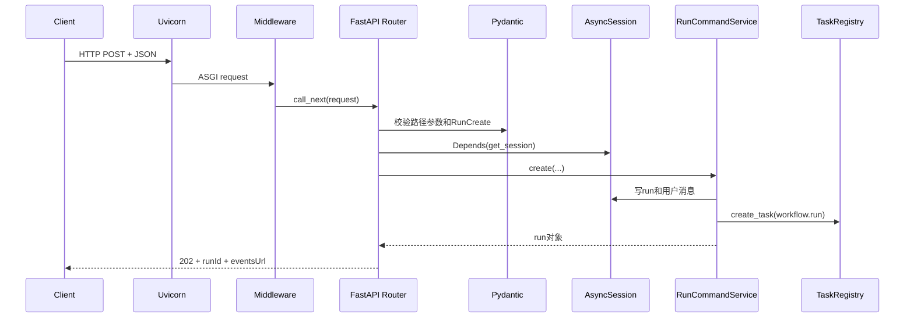

# DataAgent Python 零基础读代码指南

> 目标：不是系统学习整门 Python，而是让你能读懂、调试并在面试中讲清 DataAgent Python 后端。

如果你以前主要写 Java，可以把本项目先理解为：FastAPI 类似 Web 接口框架，Pydantic 类似运行时 DTO 校验器，SQLAlchemy 类似 ORM，LangGraph 类似带持久化状态的工作流引擎。但这些只是帮助入门的类比，不代表它们完全等价。

---

## 1. 先建立项目地图

### 1.1 Python 包和模块

Python 中：

- 一个 `.py` 文件通常是一个模块，例如 `app/main.py` 对应模块 `app.main`；
- 一个包含 Python 模块的目录是包，本项目的 `app/` 是顶层包；
- `from app.config import get_settings` 表示从 `app/config.py` 导入函数；
- `__init__.py`可以控制包对外暴露哪些名称；
- 模块第一次被导入时，模块顶层代码会执行一次，随后通常从`sys.modules`缓存复用。

本项目主要目录：

| 目录 | 职责 | 可以类比 |
|---|---|---|
| `app/api/` | HTTP路由、请求响应模型、错误映射 | Controller层 |
| `app/application/` | 创建、执行、取消、重试等用例 | Application Service层 |
| `app/domain/` | 枚举、错误、只读视图 | Domain层 |
| `app/workflow/` | LangGraph状态、节点、工具和提示词 | Agent工作流层 |
| `app/infrastructure/` | SQLite、MySQL、OpenAI SDK | Infrastructure层 |
| `app/retrieval/` | BM25、Chroma、RRF和索引 | RAG检索层 |
| `app/memory/`、`app/context/` | 摘要、上下文预算、记忆 | Context层 |
| `app/analysis/` | CSV结果集与Docker Python分析 | Analysis层 |
| `tests/` | 单元与集成测试 | Test层 |

### 1.2 环境、依赖和启动命令

[`pyproject.toml`](../pyproject.toml)同时声明了Python版本、生产依赖、开发依赖、构建方式和pytest配置。可以把它理解为本项目的`pom.xml`，但Python生态并不要求所有项目都使用同一种依赖文件。

```bash
uv sync
uv run uvicorn app.main:app --reload --port 8000
```

这两条命令分别表示：

1. `uv sync`根据`pyproject.toml`创建/更新虚拟环境并安装依赖；
2. `uv run`在该虚拟环境中执行命令；
3. `uvicorn`是ASGI服务器；
4. `app.main:app`表示导入`app.main`模块，再取得模块中的`app`对象；
5. `--reload`监听文件变化并重启开发进程，只适合本地开发。

虚拟环境的意义是让这个项目使用自己的Python解释器和依赖版本，避免和系统Python或其他项目互相污染。

### 1.3 配置是怎么来的

[`app/config.py`](../app/config.py)中的`Settings`继承`BaseSettings`，会把环境变量转换成有类型的Python字段。例如：

```text
DATA_AGENT_SQL_TIMEOUT_SECONDS=30
                ↓
Settings.sql_timeout_seconds == 30  # int，而不是字符串
```

`get_settings()`使用`@lru_cache`，因此同一进程中通常只构造一份配置对象。修改环境变量后，已经创建的对象不会自动变化；本地最稳妥的做法是重启服务。

---

## 2. 读这个项目必须会的 Python 语法

### 2.1 变量保存的是对象引用

Python变量不是装对象的固定类型盒子，而是指向对象的名称：

```python
state = {"retry_count": 0}
same_state = state
same_state["retry_count"] = 1
assert state["retry_count"] == 1
```

`dict`和`list`是可变对象。两个变量指向同一个字典时，从任一变量修改都能被另一边看到。

要复制一层字典，可写：

```python
new_state = dict(state)
# 或
new_state = {**state, "retry_count": 2}
```

这只是浅拷贝。嵌套的字典和列表仍可能共享对象。理解这一点对读LangGraph状态更新非常重要。

### 2.2 `None`与可选类型

`None`表示“没有值”，类似Java中的`null`：

```python
error: str | None = None
```

`str | None`是类型注解，表示这个变量预期是字符串或`None`。普通类型注解主要供IDE、类型检查器和读者使用，Python默认不会因为赋错类型自动报错；Pydantic等库可以主动读取注解并做运行时校验。

判断`None`通常写：

```python
if error is None:
    ...
```

不要把“没有值”和“空字符串”“空列表”“数字0”混为一谈。

### 2.3 容器类型与推导式

项目最常见的数据类型：

```python
table_names: list[str] = ["orders", "order_items"]
table_by_name: dict[str, dict] = {"orders": {"columns": []}}
selected: set[str] = {"orders"}
columns: tuple[str, ...] = ("id", "total_amount")
```

列表推导式是对循环的紧凑表达：

```python
names = [table["name"] for table in schema["tables"]]
```

等价于：

```python
names = []
for table in schema["tables"]:
    names.append(table["name"])
```

项目中推导式很多。读不懂时先手动展开成`for`循环，不要硬背。

### 2.4 解包：`*`和`**`

```python
all_results = [*old_results, new_result]
payload = {**old_payload, "status": "completed"}
```

- `*old_results`把列表元素展开；
- `**old_payload`把字典键值展开；
- 后出现的同名键覆盖先出现的键。

函数定义中的`*`还有另一个作用：

```python
async def create(*, run_id: str, columns: list, rows: list):
    ...
```

`*`后面的参数必须按名称传递，例如`create(run_id="run_01", ...)`，不能只按位置传。

### 2.5 函数、方法和闭包

类中的函数通常是实例方法，第一个参数`self`指向当前对象：

```python
class TaskRegistry:
    def cancel(self, run_id: str) -> None:
        ...
```

[`app/workflow/tools.py`](../app/workflow/tools.py)在`AnalysisToolRegistry`方法内部定义多个工具函数。这些内部函数可以访问外层的`self`和依赖，叫作闭包。它们随后被包装成LangChain工具交给模型调用。

### 2.6 装饰器

装饰器是在函数或类创建时进行包装或注册：

```python
@router.get("/runs/{run_id}")
async def get_run(...):
    ...
```

这里不是“调用`get_run`”，而是让FastAPI登记：收到对应GET请求时调用这个函数。

项目中的常见装饰器：

| 装饰器 | 作用 |
|---|---|
| `@router.get/post/delete` | 注册HTTP路由 |
| `@app.middleware("http")` | 注册HTTP中间件 |
| `@app.exception_handler(...)` | 注册异常到HTTP响应的映射 |
| `@dataclass(...)` | 自动生成初始化、比较和显示等方法 |
| `@property` | 让无参数方法按属性方式访问 |
| `@lru_cache` | 缓存函数结果 |
| `@event.listens_for(...)` | 注册SQLAlchemy事件监听器 |

### 2.7 异常为什么不能静默吞掉

```python
try:
    result = await operation()
except ValueError as error:
    logger.exception("operation failed")
    raise
finally:
    release_resource()
```

- `except`处理特定错误；
- `raise`不带参数时重新抛出当前错误，并保留原始栈；
- `finally`无论成功或失败都会执行，适合释放资源；
- `logger.exception()`应在异常处理上下文中使用，它会附带traceback。

项目约定是未知错误不能伪装成成功。预期业务错误映射成明确的4xx，未知错误保留堆栈并让run进入`failed`。

---

## 3. 项目中的五种“数据类”不要混淆

### 3.1 Pydantic `BaseModel`：运行时校验DTO

[`app/api/schemas.py`](../app/api/schemas.py)中的请求/响应模型继承`BaseModel`：

```python
class RunCreate(ApiModel):
    query: str = Field(min_length=1, max_length=20_000)
    human_review_enabled: bool = False
```

FastAPI收到JSON后会用它完成：

1. 字段是否存在的检查；
2. 类型转换与校验；
3. 长度等约束检查；
4. 生成OpenAPI文档；
5. 将响应对象序列化为JSON。

本项目通过`alias_generator`把Python内部的`run_id`序列化为前端使用的`runId`。

### 3.2 `TypedDict`：字典的静态结构说明

[`app/workflow/state.py`](../app/workflow/state.py)中的`AnalysisState`继承`TypedDict`：

```python
class AnalysisState(TypedDict, total=False):
    run_id: str
    messages: list[AnyMessage]
```

它在运行时仍然是普通`dict`，不会像Pydantic一样自动验证字段。`total=False`表示字段都可以暂时不存在，因为LangGraph节点只返回本次修改的状态增量。

### 3.3 `dataclass`：轻量普通对象

[`app/domain/views.py`](../app/domain/views.py)中的`RunView`是`@dataclass(slots=True)`：

- 自动生成`__init__`等方法；
- 主要用于内部传值；
- `slots=True`限制动态添加属性并减少单个对象开销；
- 不会自动完成Pydantic那样的输入校验。

[`app/analysis/sandbox.py`](../app/analysis/sandbox.py)中的`SandboxExecution`还使用`frozen=True`，表示实例创建后不应再修改字段。

### 3.4 SQLAlchemy ORM Model：数据库行映射

[`app/infrastructure/persistence/models.py`](../app/infrastructure/persistence/models.py)中的`AnalysisRunModel`表示`analysis_runs`表：

```python
class AnalysisRunModel(Base):
    __tablename__ = "analysis_runs"
    id: Mapped[str] = mapped_column(String(36), primary_key=True)
```

一份ORM对象通常对应数据库中的一行。修改对象属性并不一定已经写入数据库，仍需要`flush()`或`commit()`。

### 3.5 `Protocol`：结构化接口

[`app/workflow/ports.py`](../app/workflow/ports.py)中的`LlmClient(Protocol)`类似Java接口，但实现类不必显式写`implements`：只要具有兼容的方法签名，就可以被类型系统视为满足协议。

测试中的`FakeLlm`没有继承`LlmClient`，仍可以注入工作流，这就是结构化类型的价值。

### 3.6 一张表记住区别

| 类型 | 运行时校验 | 映射数据库 | 主要用途 |
|---|---:|---:|---|
| Pydantic `BaseModel` | 是 | 否 | API和LLM结构化输出 |
| `TypedDict` | 否 | 否 | 描述字典状态 |
| `dataclass` | 否 | 否 | 内部值对象 |
| SQLAlchemy Model | ORM负责 | 是 | 数据库持久化 |
| `Protocol` | 否 | 否 | 定义可替换接口 |

---

## 4. Python异步：本项目最重要的基础

### 4.1 调用`async def`不会立即跑完

```python
async def analyze():
    return "ok"

coroutine = analyze()       # 得到协程对象
result = await coroutine    # 才等待它执行完成
```

协程是可以暂停和恢复的计算。`await`等待的操作尚未完成时，当前协程把控制权交回事件循环，让事件循环继续推进其他任务。

### 4.2 `await`不等于新建线程

```python
result = await llm.complete(...)
```

通常仍在同一个事件循环线程中。网络SDK在等待响应期间不会占住线程做无用等待，所以其他协程可以运行。

只有代码明确调用`asyncio.to_thread()`、线程池API或创建子进程时，工作才会转移到其他线程或进程。

### 4.3 `create_task()`为什么能后台运行

[`app/application/tasks.py`](../app/application/tasks.py)中：

```python
task = asyncio.create_task(coroutine, name=f"analysis-run-{run_id}")
```

`create_task()`把协程登记给当前事件循环，并立即返回`Task`对象。于是创建run的HTTP接口可以先返回`202 Accepted`，分析任务继续在后台推进。

这里的“后台”是**同一Python进程中的异步任务**，不是消息队列、独立工作进程或分布式任务。

### 4.4 `async for`和异步生成器

```python
async def event_stream():
    while True:
        events = await load_events()
        for event in events:
            yield format_sse(event)
```

函数中同时出现`async def`和`yield`时，它是异步生成器。调用者用`async for`逐项读取，不需要等所有结果都生成后再返回。

本项目有两条重要的异步流：

1. LangGraph的`graph.astream(...)`逐步产生节点更新；
2. FastAPI的`StreamingResponse`逐帧产生SSE文本。

二者不是同一条内存流。执行器先把图更新写入`run_events`，SSE接口再轮询数据库并发送给前端。

### 4.5 `async with`和资源释放

```python
async with session_factory() as session:
    repository = Repository(session)
    ...
```

`async with`是异步上下文管理器。进入时获得资源，离开代码块时自动执行异步清理。即使中间抛异常，Session也会被关闭并归还连接。

[`app/main.py`](../app/main.py)中的`lifespan`也是异步上下文管理器：`yield`之前是应用启动，`yield`之后是应用关闭。

### 4.6 为什么使用`asyncio.to_thread()`

MySQL使用的`pymysql`、CSV读写以及部分Chroma操作是同步阻塞调用。直接放在事件循环线程中，会让其他HTTP请求和SSE都暂时无法推进。

```python
rows = await asyncio.to_thread(sync_query)
```

这表示把同步函数交给线程池，再异步等待结果。它并不会把整个请求固定到那个线程上。

重要边界：取消等待`to_thread()`结果的协程，不能强制杀死已经运行的Python线程。底层数据库超时和查询限制仍然必须存在。

### 4.7 Docker属于独立进程

[`app/analysis/sandbox.py`](../app/analysis/sandbox.py)通过`asyncio.create_subprocess_exec()`启动Docker CLI：

```text
FastAPI进程
  └─ docker CLI子进程
       └─ 临时容器中的Python进程
```

超时时代码会`kill()`子进程。但当前普通任务取消路径没有专门捕获`CancelledError`并清理已启动的Docker进程，这是项目已知边界。

### 4.8 取消是协作式的

`task.cancel()`不会像操作系统强杀进程一样立刻停止所有代码。它会在协程下一次可取消的等待点抛出`CancelledError`。

因此：

- 正在`await`网络、Sleep或其他协程时通常能较快取消；
- 正在事件循环中执行很长的纯Python循环时，其他任务无法及时运行；
- 已经进入`to_thread()`的同步操作不会被强制停止；
- 子进程需要显式终止。

### 4.9 `ContextVar`不是`ThreadLocal`

[`app/observability/context.py`](../app/observability/context.py)使用`ContextVar`保存当前`run_id`，让同一异步调用链的日志自动带上运行标识。

它是异步任务上下文，不是业务状态数据库，也不是会话存储。执行器进入时`set()`，`finally`中`reset()`；真正的会话和run仍保存于SQLite。

---

## 5. 一次FastAPI请求到底经过什么

以`POST /api/v1/conversations/{conversation_id}/runs`为例：



### 5.1 Uvicorn、ASGI和FastAPI的关系

- Uvicorn是服务器，监听端口并实现ASGI协议；
- FastAPI是应用框架，负责路由、校验和依赖注入；
- `app = FastAPI(...)`是ASGI应用对象；
- 浏览器不会直接调用Python函数，而是通过HTTP进入Uvicorn。

### 5.2 中间件

[`app/main.py`](../app/main.py)中的请求日志中间件包围整个HTTP处理过程：记录`request_id`、方法、路径、状态码和耗时。未知异常会记录traceback后重新抛出。

中间件测量的是“HTTP请求返回用了多久”。创建run接口很快返回，它不包含后台Agent运行的总耗时。

### 5.3 路由和Pydantic校验

FastAPI根据函数签名识别参数来源：

```python
async def create_run(
    conversation_id: str,  # 路径参数
    body: RunCreate,       # JSON请求体
    session: SessionDependency,  # 依赖注入
):
```

校验失败时FastAPI返回422，函数不会进入业务逻辑。

### 5.4 `Annotated`和`Depends`

[`app/api/dependencies.py`](../app/api/dependencies.py)中：

```python
SessionDependency = Annotated[AsyncSession, Depends(get_session)]
```

这表示参数的Python类型是`AsyncSession`，同时告诉FastAPI使用`get_session()`构造它。它是框架依赖注入，不是Spring容器中的全局单例Session。

### 5.5 为什么返回202而不是等待分析完成

Agent可能需要多次LLM和SQL调用。如果HTTP接口一直等到结束：

- 更容易被网关超时；
- 前端无法可靠恢复；
- 用户取消、人工审核和过程展示更难实现。

因此创建接口只负责持久化run并启动任务，前端再通过详情API和SSE观察状态。

### 5.6 异常如何变成HTTP响应

[`app/api/errors.py`](../app/api/errors.py)目前显式映射：

| Python异常 | HTTP状态 |
|---|---:|
| `ResourceNotFoundError` | 404 |
| `InvalidOperationError` | 409 |
| Pydantic/FastAPI校验错误 | 422 |
| 未处理异常 | 500 |

后台Task中的异常已经离开创建run的HTTP请求，不能再改变那个202响应。执行器会把run标记为`failed`并写入`run.failed`事件。

---

## 6. SQLAlchemy：对象、Session和事务

### 6.1 Engine、连接池、Session、ORM对象

```text
Engine
  └─ Connection Pool
       └─ DB Connection

AsyncSession
  └─ 当前工作单元与事务上下文
       └─ ORM对象
```

- `Engine`管理数据库方言和连接池；
- 连接池复用物理连接；
- `AsyncSession`跟踪本次读取和修改的ORM对象；
- ORM对象对应表中的记录，但内存状态和数据库状态并非时刻同步。

### 6.2 `add`、`flush`、`commit`、`refresh`

| 操作 | 含义 |
|---|---|
| `session.add(obj)` | 把对象加入当前Session，尚不保证数据库已提交 |
| `flush()` | 把待执行SQL发送到数据库，但事务仍可回滚 |
| `commit()` | 提交事务，使其他事务能够看到结果 |
| `rollback()` | 回滚当前事务 |
| `refresh(obj)` | 从数据库重新读取该对象字段 |

本项目Repository方法普遍在内部直接`commit()`。因此一次应用用例可能被拆成多个小事务：例如先提交run，再提交消息，再更新标题。中途失败时，之前已经提交的数据不会自动整体回滚。

### 6.3 “共享Session”不等于“共享一个事务”

`Repository(session)`的多个子仓储确实共享同一个Session对象，但它们的方法内部反复`commit()`。所以当前设计更准确的说法是“共享Session和连接管理方式”，而不是“整次请求具有单一原子事务”。

如果以后要求创建run、用户消息和会话标题必须要么全部成功、要么全部失败，应把事务边界上移到应用服务，由Repository只做`flush()`，最后统一`commit()`。

### 6.4 当前`version`不是严格乐观锁

`save_run()`目前执行：

```python
run.version += 1
await session.commit()
```

它可以记录“保存过多少次”，但没有执行类似下面的条件更新：

```sql
UPDATE analysis_runs
SET ..., version = old_version + 1
WHERE id = ? AND version = old_version;
```

因此它没有检测另一个并发写入是否已经修改了版本，不能称为完整乐观锁。

### 6.5 SQLite的WAL、busy timeout和外键

[`app/infrastructure/persistence/database.py`](../app/infrastructure/persistence/database.py)为每个SQLite连接设置：

- `journal_mode=WAL`：读写并发比默认日志模式更友好；
- `busy_timeout=5000`：遇到短暂写锁时等待最多5秒；
- `foreign_keys=ON`：让SQLite真正执行外键与级联删除。

WAL不是“无限并发写”。SQLite仍然只有一个写入者，多任务频繁提交时仍可能竞争写锁。

### 6.6 两套数据库引擎不要混淆

| 引擎 | 访问内容 | 异步方式 |
|---|---|---|
| `create_async_engine` | `app.db`应用数据 | SQLAlchemy异步驱动`aiosqlite` |
| `create_engine` | MySQL销售数据 | 同步`pymysql`放进`to_thread()` |

MySQL引擎设置了连接池、连接探活、只读Session和超时；SQLite引擎负责应用元数据。它们不是同一个DataSource。

---

## 7. LangGraph在项目里做了什么

### 7.1 Graph不是线程，也不是数据库

LangGraph负责把节点和路由组织成状态机：

```text
input_guard
→ agent_decide
→ tools / result
→ sql_validate
→ human_feedback
→ sql_execute
→ agent_decide
```

节点是普通异步Python函数；边决定下一个节点；`AnalysisState`是节点间传递的数据；checkpointer负责保存状态快照。

### 7.2 节点返回状态增量

```python
return {
    "sql": safe_sql,
    "safety": {"passed": True},
    "pending_sql_execution": True,
}
```

节点通常不需要返回完整状态，只返回改变的部分。LangGraph将增量合并到状态。`messages`字段配置了`add_messages` reducer，因此新消息是合并，而不是简单覆盖。

### 7.3 `StateGraph`、`compile`和运行时

[`app/workflow/graph.py`](../app/workflow/graph.py)只描述图结构。应用启动时，[`app/workflow/runtime.py`](../app/workflow/runtime.py)完成：

1. 创建基础设施依赖；
2. 打开`AsyncSqliteSaver`；
3. 构建节点；
4. `compile(checkpointer=...)`得到可执行图；
5. 用`graph.astream()`执行。

### 7.4 checkpoint为什么能恢复人工审核

执行到`interrupt()`时，LangGraph已经把状态保存到`checkpoints.db`。审核接口随后使用相同`thread_id=run_id`调用：

```python
Command(resume={"approved": True, "comment": ""})
```

LangGraph从对应快照继续，而不是从用户问题重新执行全部节点。

### 7.5 checkpoint不等于会话记忆

- checkpoint服务于**一次run的图执行恢复**；
- `messages`和`conversations.summary`服务于**多轮会话**；
- `thread_id`当前使用`run_id`，不是`conversation_id`；
- run成功后checkpoint会删除，但会话历史仍在`app.db`。

---

## 8. LLM消息与原生Tool Calling

### 8.1 一次模型请求包含什么

典型消息角色：

| role | 含义 |
|---|---|
| `system` | 系统规则和角色约束 |
| `user` | 用户问题或应用构造的上下文 |
| `assistant` | 模型文本或工具调用请求 |
| `tool` | 工具执行结果，必须关联tool call ID |

模型不是直接调用Python函数。它返回结构化的工具名称与参数，应用找到对应工具、执行函数，再把结果作为`ToolMessage`发回模型。

### 8.2 ReAct循环在代码中的形态

```text
模型决定动作
→ 工具执行
→ 工具结果进入messages/state
→ 模型观察结果并决定下一步
→ 直到模型不再调用工具
```

[`agent_decide`](../app/workflow/nodes/analysis.py)负责模型决策，[`LoggingToolNode`](../app/workflow/tools.py)负责工具调用，图中的条件边让二者循环。

### 8.3 为什么还要确定性节点

即使模型请求`execute_sql`，工具也只把SQL放入状态并设置待校验标记。真正执行前还必须经过：

1. SQLGlot AST校验；
2. Schema白名单和敏感字段校验；
3. 可选人工审核；
4. MySQL只读连接和超时。

这说明Agent负责提出动作，系统负责决定动作是否允许执行。

### 8.4 Pydantic结构化输出

最终分析要求模型输出[`AnalysisOutput`](../app/workflow/outputs.py)结构。LLM返回JSON后，Pydantic检查字段类型并生成对象。模型输出不是天然可信数据，仍需验证和归一化。

---

## 9. 状态、数据库和文件之间如何对应

| 数据 | 运行时位置 | 持久化位置 | 生命周期 |
|---|---|---|---|
| HTTP请求参数 | 路由函数局部变量 | 必要字段写入SQLite | 请求结束后局部变量释放 |
| 当前图状态 | `AnalysisState` | `checkpoints.db` | run执行期间；按终态策略清理 |
| 后台执行句柄 | `TaskRegistry._tasks` | 不持久化 | Task完成/取消后移除；重启丢失 |
| 当前日志run标识 | `ContextVar` | 日志文本 | `_consume`期间 |
| 会话及消息 | ORM对象 | `app.db` | 删除会话前长期存在 |
| run、stage和事件 | ORM对象 | `app.db` | 删除会话时级联删除 |
| LLM工具轨迹 | LangChain消息对象 | `tool_calls`与部分artifact | 随run持久化 |
| SQL预览 | `AnalysisState.rows` | `result_sets.rows` | 随结果集记录存在 |
| SQL完整结果 | 节点执行中的列表 | CSV | 默认7天或磁盘配额触发清理 |
| RAG文档向量 | 检索器/Chroma对象 | `data/chroma/` | 重建索引或手动删除前存在 |
| Python分析进程 | asyncio subprocess | 不持久化 | 进程退出；产物文件保留 |

关键结论：Python变量、LangGraph State、checkpoint、业务数据库记录和CSV是五个不同层次。不能因为某个字段出现在State中，就认为它已经写入`app.db`。

---

## 10. 谁创建资源，谁负责关闭

| 资源 | 创建者 | 释放位置 |
|---|---|---|
| 日志handler | FastAPI lifespan | 进程结束；轮转文件由handler管理 |
| `app.db` Engine | persistence模块 | `close_database()` |
| 请求级`AsyncSession` | FastAPI `Depends(get_session)` | 依赖生成器退出时 |
| 执行器内部Session | `session_factory()` | 每个`async with`退出时 |
| MySQL Engine | `GraphRuntime.database`懒加载 | `GraphRuntime.shutdown()` |
| OpenAI SDK客户端 | `GraphRuntime` | `GraphRuntime.shutdown()` |
| LangGraph Saver | `GraphRuntime.startup()` | `GraphRuntime.shutdown()` |
| checkpoint清理Task | `GraphRuntime.startup()` | shutdown时cancel并等待 |
| run后台Task | `TaskRegistry.start()` | 完成回调移除；取消或shutdown等待 |
| Docker子进程 | `DockerPythonSandbox.execute()` | 正常退出或超时kill；普通取消仍有边界 |

FastAPI关闭顺序位于`lifespan`的`yield`之后：先关闭run任务，再关闭GraphRuntime，最后关闭应用数据库Engine。这个顺序避免基础设施先被关掉，而后台任务仍尝试写库。

---

## 11. pytest：如何读项目测试

### 11.1 pytest如何发现测试

默认会寻找：

- `tests/`目录；
- `test_*.py`文件；
- `test_*`函数。

运行：

```bash
uv run pytest
uv run pytest tests/test_sql_policy.py -q
uv run pytest tests/test_api.py::test_complete_run_populates_frontend_contract -q
```

### 11.2 fixture是什么

fixture用于准备测试依赖和清理资源。项目的[`tests/conftest.py`](../tests/conftest.py)会在测试模块导入前设置临时SQLite、检索后端和快速轮询配置。

`tmp_path`是pytest内置fixture，每个测试获得独立临时目录。`monkeypatch`可以临时修改环境变量或对象属性，测试结束后自动恢复。

### 11.3 异步测试

```python
@pytest.mark.asyncio
async def test_something():
    result = await async_operation()
    assert result == expected
```

`pytest-asyncio`为异步测试提供事件循环。本项目还在`pyproject.toml`中配置了`asyncio_mode = "auto"`。

### 11.4 Fake不是“返回成功的兜底”

[`tests/test_api.py`](../tests/test_api.py)中的`FakeLlm`和`FakeDatabase`只在测试环境替换外部服务，使测试快速、确定且无需API Key。生产代码不会在真实LLM失败时自动使用它们。

好的Fake应满足：

1. 实现与真实端口相同的方法；
2. 根据输入返回确定结果；
3. 能暴露调用参数供断言；
4. 不隐藏被测逻辑的真实错误。

### 11.5 三类测试分别证明什么

| 测试 | 证明内容 |
|---|---|
| 纯函数单元测试 | SQL策略、分词、RRF等确定性逻辑 |
| 组件测试 | LLM客户端请求构造、检索器、记忆等组件契约 |
| API集成测试 | FastAPI、真实LangGraph、SQLite、SSE和持久化能否串起来 |

测试通过不能证明真实模型一定生成正确SQL，也不能证明真实MySQL、Embedding服务和Docker配置正确。外部集成仍需要本地或评测环境验证。

---

## 12. 初学者练习顺序

不要从`executor.py`第1行硬读到最后。按下面顺序动手，每一步只解决一个问题。

### 练习1：看懂一个普通API

阅读创建会话接口，回答：

1. JSON由哪个Pydantic模型校验？
2. Session从哪里来？
3. 哪个Repository方法执行了`commit()`？
4. 返回模型为什么是camelCase？

### 练习2：追踪一次run创建

从路由走到`RunCommandService.create()`，在纸上写出：

```text
conversation → analysis_run → user message → asyncio.Task
```

重点理解HTTP已经返回，但Task仍在运行。

### 练习3：追踪一次Agent循环

只看：

```text
agent_decide → tools → sql_validate → sql_execute → agent_decide
```

记录每个节点读取了哪些State字段，又返回哪些增量。

### 练习4：追踪一次结果落库

从`sql_execute`依次找到：

1. MySQL结果；
2. CSV文件；
3. `result_sets`预览；
4. `queries`记录；
5. `artifacts`查询产物；
6. `run_events`SSE事件。

### 练习5：主动制造错误

依次尝试：

- 不配置API Key；
- 查询不存在字段；
- 执行`DELETE`；
- 在运行中取消；
- 停掉MySQL；

每次都用`run_id`回答：错误最早出现在哪一层、数据库保存了什么、前端最终看到什么。

---

## 13. Java开发者常见误区

| 容易误解 | 正确认识 |
|---|---|
| `thread_id`是线程ID | 它是LangGraph状态关联键，当前值为`run_id` |
| `await`会启动新线程 | `await`通常只暂停当前协程并交还事件循环 |
| `asyncio.Task`是线程 | 它是事件循环调度的协程执行句柄 |
| 类型注解会自动校验 | 普通注解不会；Pydantic等框架才会主动校验 |
| `TypedDict`是DTO对象 | 它在运行时仍是普通字典 |
| `Protocol`必须显式实现 | Python结构化类型只要求方法形状兼容 |
| 同一个Session就是同一事务 | 中途`commit()`已经切断原子事务边界 |
| 修改ORM对象就已经落库 | 至少要flush，想对外可见通常还要commit |
| SSE断开会取消任务 | 当前SSE只是观察run，断开不会取消后台Task |
| checkpoint就是聊天记录 | checkpoint是run状态快照，会话消息在`app.db` |
| `task.cancel()`能强杀一切 | 线程和子进程需要各自的终止机制 |

---

## 14. 最小术语表

| 术语 | 在本项目中的含义 |
|---|---|
| Coroutine | 可暂停和恢复的异步函数执行对象 |
| Event Loop | 调度协程、网络IO和Task的循环 |
| Task | 被事件循环安排执行的协程句柄 |
| ASGI | Python异步Web服务器与应用之间的协议 |
| Middleware | 包围HTTP请求处理过程的通用逻辑 |
| Dependency | FastAPI按函数签名构造并注入的对象 |
| ORM | Python对象与数据库表/行之间的映射 |
| Session | SQLAlchemy工作单元和事务上下文 |
| State | LangGraph节点间传递的运行时字典 |
| Checkpoint | 某次图执行的序列化状态版本 |
| Artifact | 面向业务展示和追踪的结构化运行产物 |
| Tool Call | 模型提出的一次结构化函数调用请求 |
| SSE | 服务端通过单向HTTP长连接持续发送文本事件 |
| RRF | 根据多个排名位置融合结果的算法 |
| ContextVar | 随异步上下文传播的局部变量 |

读完后，你至少应该能不看文档解释：`HTTP请求`、`asyncio.Task`、`AnalysisState`、`checkpoint`、`app.db`和`CSV`分别保存什么，以及它们何时结束生命周期。
